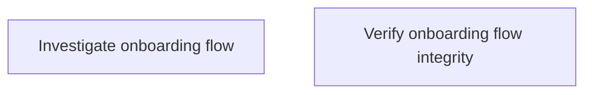

# Execution Plan

- Graph ID: `graph-2026-05-29-77d2bc44`
- Product: `workspace-saas`
- Flow: `workspace-onboarding`
- Status: `planned`
- Created: `2026-05-29T08:51:51Z`
- Nodes: 2
- Edges: 0
- Checkpoints: 2
- Max parallel: 2

## Summary

_Planning decisions will be recorded here._

## Graph

