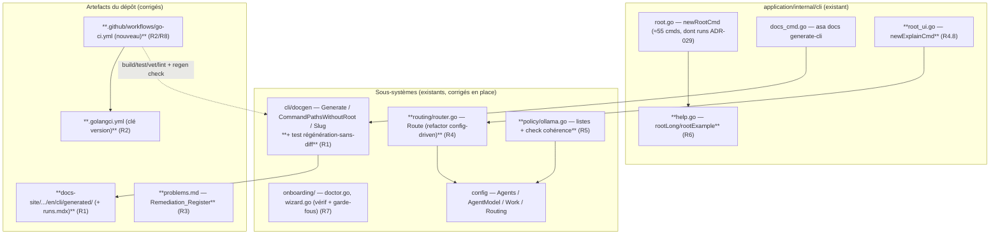
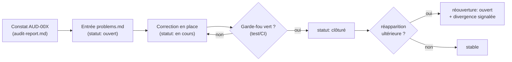

# Design Document

> Feature : audit-coherence-consolidation
> Nature : **correction & simplification**, pas un nouveau sous-système.

## Overview

Cette feature **n'ajoute aucune couche** et **ne crée aucun moteur d'audit
runtime**. L'audit ([`audit-report.md`](./audit-report.md)) est une activité
terminée ; ce design décrit comment **corriger** les sept constats stables
`AUD-001` … `AUD-007`, **simplifier** la couche d'orchestration perçue comme
opaque, et poser les **garde-fous** qui empêchent la régression — en touchant
exclusivement des fichiers existants du dépôt.

La dérive est concentrée et de cause unique : la commande `runs` (ADR-029) n'a
pas été suivie d'une régénération de la doc CLI. Le design applique donc le
**plus petit changement correct** par constat, plutôt qu'une refonte.

### Principes directeurs

1. **Pas de nouvelle couche.** Aucun package `internal/audit`, aucun `asa audit`.
   Chaque correction se loge dans un fichier existant (`docgen`, `routing`,
   `policy`, `cli`, `onboarding`, `problems.md`, CI, `Makefile`, `.golangci.yml`).
2. **Plus petit changement correct.** On corrige la cause, pas les symptômes :
   régénérer (et non patcher 50 pages à la main), piloter le routing par la
   config (et non ajouter des cas particuliers).
3. **Invariant ADR-027 préservé.** L'UI reste cliente du bus ; aucune logique
   métier n'entre dans `internal/ui`. Les corrections de routing/policy restent
   dans `internal/routing` et `internal/policy`.
4. **Toutes les Unitary_Command préservées.** `asa spec | plan | enrich | dev |
   verify | review` (et les autres) restent exécutables seules. Le Guided_Path
   est mis en avant **sans rien retirer**.
5. **Déterminisme local-first.** Sorties identiques pour entrées identiques
   (ADR-002, ADR-022) ; pas de `panic` aux frontières CLI, erreurs retournées
   comme valeurs (`03-standards.md`).
6. **Garde-fous, pas surveillance.** Les contrôles anti-régression sont des
   **tests** (package concerné) et/ou des **étapes CI**, jamais un service runtime.

### Cartographie constat → correction → fichiers réels

| Constat | Sévérité | Correction (plus petit changement) | Fichiers réels | Exigence |
| --- | --- | --- | --- | --- |
| AUD-001 | error | Régénérer la doc CLI → ajoute `runs.mdx` | `docs-site/content/docs/en/cli/generated/` (via `asa docs generate-cli`) | R1 |
| AUD-002 | error | Même régénération → rafraîchit le lien fratrie `> - [Runs](./runs.mdx)` sur les pages sœurs | idem | R1 |
| (garde-fou) | — | Test « régénération sans diff » dans le package `docgen` + étape CI | `application/internal/cli/docgen/*_test.go`, `.github/workflows/*` | R1, R8 |
| AUD-003 | error | Pinner golangci-lint (build go1.25), corriger `.golangci.yml` (clé `version`), ajouter un workflow Go CI | `.golangci.yml`, `.github/workflows/go-ci.yml` (nouveau), `Makefile` | R2, R8 |
| AUD-004 | warn | Faire de `problems.md` le Remediation_Register (entrées `AUD-*`, automate de statut) | `problems.md` | R3 |
| AUD-005 | warn | Routing config-driven : valider l'agent contre `cfg.Agents`, précédence `no_cloud`, erreur guidée, raison exposée ; câbler `asa explain` | `application/internal/routing/router.go`, `application/internal/cli/root_ui.go` | R4 |
| AUD-006 | info | Relier les listes de rôles Ollama au canon courant + check de cohérence | `application/internal/policy/ollama.go`, `application/internal/policy/*_test.go` | R5 |
| AUD-007 | info | Mettre en avant le Guided_Path dans le help racine + une page docs, sans retirer de commande | `application/internal/cli/help.go`, `docs-site/content/docs/en/` | R6 |

### Ce qui est déjà sain (à vérifier, pas à corriger)

L'audit confirme : `build`/`vet`/`test` verts, aucun secret en clair, locales
alignées hors CLI générée, docgen déterministe. Le design **réutilise** ces
acquis et ajoute uniquement les garde-fous manquants ; il ne réécrit ni docgen,
ni l'onboarding, ni la couche UI.

## Architecture

Aucune architecture nouvelle n'est introduite. Les corrections se branchent sur
les points d'extension existants. Le schéma situe les fichiers touchés (en gras)
dans la topologie actuelle.



### Frontières respectées

- Les corrections de logique restent dans `internal/routing` et
  `internal/policy` ; `internal/ui` n'acquiert **aucune** logique métier
  (ADR-027). `asa explain` (dans `cli/`) **appelle** `routing.Route` mais la
  décision elle-même demeure une fonction pure du package `routing`.
- L'écriture des MDX et la marche de l'arbre Cobra restent **exclusivement**
  dans `cli/docgen`. Le garde-fou anti-régression est un **test** de ce package
  (et une étape CI), pas un nouveau composant.
- `problems.md` reste un artefact Markdown à la racine, maintenu à la main ;
  aucun code ne le génère ni ne le lit au runtime.

### Boucle de remédiation (hors runtime)

La correction est appliquée en phase tasks ; la clôture est **prouvée** par
l'exécution réelle des garde-fous (régénération-sans-diff vert, Quality_Gate
vert). `problems.md` trace l'avancement.



## Components and Interfaces

Chaque sous-section traite un constat, cite l'exigence, et décrit le **plus
petit changement correct** sur des fichiers réels.

### R1 — Parité CLI ↔ doc générée + garde-fou (AUD-001 / AUD-002)

**Cause.** `asa runs` est enregistrée (`root.go`, `newRunsCmd`) mais
`docs-site/content/docs/en/cli/generated/runs.mdx` n'existe pas, et ~50 pages
sœurs n'ont pas le lien fratrie `> - [Runs](./runs.mdx)`. La cause unique :
`asa docs generate-cli` non relancé après ADR-029.

**Correction (action unique).** Régénérer la référence CLI :

```bash
go run ./application/cmd/asa docs generate-cli \
  --output docs-site/content/docs/en/cli/generated
```

`docgen.Generate` (déterministe : `eachSortedCommand` trie par `Name()`,
`removeStaleMDX` purge les `.mdx` obsolètes) reconstruit l'intégralité du
corpus : ajoute `runs.mdx` (AUD-001) et rafraîchit `relatedCommandsSection` de
chaque page sœur pour inclure le lien `Runs` (AUD-002). **Aucune** modification
de `docgen.go` n'est requise — le générateur est déjà correct.

**Garde-fou : Regeneration_Check (où et comment).** Le garde-fou vit à **deux
niveaux complémentaires** :

1. **Test Go dans le package `docgen`** (anti-régression local, exécuté par
   `go test ./...`). Nouveau test dans
   `application/internal/cli/docgen/` qui :
   - construit l'arbre vivant via `cli.RootCommand()` ;
   - régénère dans `t.TempDir()` via `docgen.Generate` ;
   - compare **octet pour octet** chaque `*.mdx` du tmp au fichier committé
     correspondant sous `docs-site/content/docs/en/cli/generated/` ;
   - échoue en **listant** les fichiers manquants ou divergents (exigences 1.4,
     1.5). C'est l'extension naturelle de `TestCLICommandsDocumented` (qui
     vérifie déjà la bijection commande ↔ page en tmp).

2. **Étape CI** dans le workflow Go (voir R2) : exécute la même régénération vers
   un dossier temporaire et `diff` contre le committé ; sortie non nulle si
   divergence. Cela couvre le cas « une commande est ajoutée sans régénérer ».

**Traitement de `meta.json` (anti faux-positif).** `meta.json` est **maintenu à
la main** (`{"title": "Command reference", "defaultOpen": false}`) et **n'est pas
émis** par `docgen` (qui n'écrit que des `*.mdx`). Le garde-fou doit donc :

- ne comparer **que** les fichiers d'extension `.mdx` ;
- **exclure explicitement** `meta.json` de l'ensemble « fichiers présents non
  attendus » (sinon le diff signalerait `meta.json` comme orphelin à chaque
  exécution). Concrètement : `present = { e ∈ dir | ext(e) == ".mdx" }`, et
  l'assertion d'orphelins ignore tout nom ≠ `*.mdx`.

Pseudocode du garde-fou (test + équivalent CI) :

```text
expected := { Slug(p) + ".mdx" | p ∈ CommandPathsWithoutRoot(root) }
regen    := Generate(root, tmpDir)              // déterministe (P2)
committed := { e ∈ generatedDir | ext(e)==".mdx" }   // meta.json exclu

missing  := expected \ committed
orphan   := committed \ expected
diff     := { f ∈ (expected ∩ committed) | bytes(tmp/f) != bytes(committed/f) }

if missing ∪ orphan ∪ diff ≠ ∅:
    report(missing, orphan, diff)               // liste les fichiers
    exit ≠ 0                                     // (1.4, 1.5)
else:
    exit 0
```

### R2 — Gate de lint réparé + Go CI (AUD-003)

**Cause.** Le binaire golangci-lint installé est construit avec go1.24 alors que
`go.mod` cible `go 1.25.0` → il refuse de tourner
(« the Go language version (go1.24) … is lower than the targeted Go version
(1.25.0) »). Aujourd'hui il n'existe **aucun** workflow Go CI ; le seul workflow
(`docs-cloudflare-pages.yml`) régénère la doc au déploiement mais **sans**
garde-fou qui échoue sur dérive.

**Correction 1 — pinner golangci-lint sur un binaire bâti avec go ≥ 1.25.**
Version exacte retenue : **golangci-lint `v2.x` (≥ v2.5.0, ligne v2 courante,
ex. `v2.12.2`)**, dont les binaires officiels sont compilés avec une toolchain Go
≥ 1.25. Commande d'installation reproductible (binaire officiel, indépendant du
Go local — recommandé par l'éditeur) :

```bash
# binaire dans $(go env GOPATH)/bin
curl -sSfL https://raw.githubusercontent.com/golangci/golangci-lint/HEAD/install.sh \
  | sh -s -- -b "$(go env GOPATH)/bin" v2.12.2
golangci-lint --version   # doit afficher "built with go1.25" ou supérieur
```

> Note : on évite `go install …/golangci-lint` (compile avec le Go local, donc
> reproductibilité non garantie) ; on privilégie le binaire officiel pinné.

**Correction 2 — `.golangci.yml` valide v2.** Le fichier actuel échoue à la
validation (clé `version` manquante, `issues.exclude-use-default` interdite en
v2). Schéma corrigé, minimal et explicite, avec la cible Go alignée sur `go.mod` :

```yaml
version: "2"            # requis par golangci-lint v2
run:
  timeout: 5m
  tests: true
  go: "1.25"            # aligne l'analyse sur go.mod (go 1.25.0)
linters:
  enable:
    - errcheck
    - govet
    - ineffassign
    - staticcheck
    - unused
```

**Correction 3 — Quality_Gate documenté et exécutable.** Le Quality_Gate est
défini comme : `make build` **ET** `go test ./...` **ET** `go vet ./...` **ET**
`golangci-lint run`, **tous** en sortie 0 (exigences 2.3, 8.2). Les cibles
existent déjà dans le `Makefile` (`build`, `test`, `vet`, `lint`) — aucune
nouvelle cible nécessaire.

**Correction 4 — workflow Go CI (nouveau fichier).** Comme aucun job Go n'existe,
on ajoute `.github/workflows/go-ci.yml`, déclenché sur `push`/`pull_request`,
qui matérialise le Quality_Gate **plus** la Regeneration_Check (R1) :

```yaml
name: Go CI
on: [push, pull_request]
jobs:
  quality-gate:
    runs-on: ubuntu-latest
    steps:
      - uses: actions/checkout@v4
      - uses: actions/setup-go@v5
        with: { go-version-file: go.mod }   # toolchain = cible go.mod
      - run: make build
      - run: go vet ./...
      - run: go test ./...
      - name: Install pinned golangci-lint
        run: curl -sSfL https://raw.githubusercontent.com/golangci/golangci-lint/HEAD/install.sh | sh -s -- -b "$(go env GOPATH)/bin" v2.12.2
      - run: golangci-lint run
      - name: CLI docs regeneration check
        run: |
          go run ./application/cmd/asa docs generate-cli --output /tmp/cli-regen
          diff -ruq /tmp/cli-regen docs-site/content/docs/en/cli/generated \
            --exclude=meta.json
```

Si la toolchain de build de golangci-lint est inférieure à la cible `go.mod`, le
binaire émet nativement une erreur nommant version attendue et détectée
(exigence 2.4) ; le pin v2 l'évite par construction.

### R3 — Remediation_Register dans `problems.md` (AUD-004)

**Cause.** `problems.md` (revue `2026-05-17`) affirme « tous GAP clôturés », mais
la dérive AUD-001/002 date du `2026-05-31`. Le registre ne reflète plus la
réalité.

**Correction.** Faire de `problems.md` le Remediation_Register de cette tranche :
une entrée par constat `AUD-*`, en réutilisant le **schéma de table existant**
`| ID | Zone | Problème | Sévérité | Statut |`.

Schéma normalisé des statuts (exigence 3.2) — valeurs **exactes** `ouvert`,
`en cours`, `clôturé` :

| Colonne | Contenu | Contrainte |
| --- | --- | --- |
| `ID` | Identifiant stable du constat (`AUD-001` … `AUD-007`) | clé de jointure avec `audit-report.md` |
| `Zone` | Zone du constat (ex. `docs-site / docgen`) | non vide |
| `Problème` | Description courte + action de correction | non vide |
| `Sévérité` | `info` \| `warn` \| `error` \| `blocking` | reprise de l'audit |
| `Statut` | `ouvert` \| `en cours` \| `clôturé` | exactement une valeur |

Automate de statut (exigences 3.2, 3.4) :

```mermaid
stateDiagram-v2
  [*] --> ouvert
  ouvert --> en_cours : prise en charge
  en_cours --> "clôturé" : garde-fou vert (test/CI)
  "clôturé" --> ouvert : réapparition → divergence signalée
```

Transitions autorisées : `ouvert → en cours → clôturé` et la réouverture
`clôturé → ouvert`. Règles de cohérence (exigences 3.1, 3.3, 3.5, 8.6) :
- exactement une entrée pour chaque constat `error`/`blocking`
  (`AUD-001`, `AUD-002`, `AUD-003`) ;
- un constat n'est `clôturé` que lorsque son garde-fou passe au vert ;
- aucun constat `blocking` ne reste `ouvert` (ni absent) à la clôture de la
  tranche.

Entrées initiales (statut `ouvert`), exemple de forme :

```text
| AUD-001 | docs-site / docgen | runs.mdx manquant ; régénérer la doc CLI | error | ouvert |
| AUD-002 | docs-site / docgen | ~50 pages sans lien fratrie Runs ; régénération | error | ouvert |
| AUD-003 | outillage / CI | golangci-lint inopérant ; pin v2 + Go CI | error | ouvert |
| AUD-004 | registre de dérive | problems.md périmé ; en faire le registre | warn | en cours |
| AUD-005 | routing | noms d'agents codés en dur ; routing config-driven | warn | ouvert |
| AUD-006 | policy Ollama | rôles liés à une spec historique ; check cohérence | info | ouvert |
| AUD-007 | UX CLI | chemin guidé noyé ; mise en avant sans retrait | info | ouvert |
```

### R4 — Routing config-driven et explicable (AUD-005)

**Cause.** `routing.Route` pose `Agent: "cursor"` en valeur initiale, force
`d.Agent = "claude"` en branche `cloud_heavy`, retombe sur `"ollama"` si
`DefaultEnricher` est vide — **sans** vérifier contre `cfg.Agents`. De plus
`preferLocal` est évalué **avant** `noCloud` : si les deux sont vrais, la raison
retournée est `prefer_local` au lieu de `no_cloud` (viole l'exigence 4.4).

**Correction.** Refactor de la **fonction existante** (pas de nouveau moteur) :
`Route` reste pure, mais sa signature évolue pour porter un chemin d'erreur guidé
au lieu de pointer un backend non déclaré.

Delta de signature :

```go
// AVANT — application/internal/routing/router.go
func Route(cfg *config.Config, stepClass string,
    preferLocal, noCloud, allowCloud bool) Decision

// APRÈS — erreur guidée si aucun backend déclaré ne correspond (4.7)
func Route(cfg *config.Config, stepClass string,
    preferLocal, noCloud, allowCloud bool) (Decision, error)

// Erreur sentinelle exportée, sans panic, message actionnable.
var ErrNoDeclaredBackend = errors.New(
    "routing: aucun Agent_Backend déclaré dans config.agents ne correspond à la décision")
```

`Decision` conserve ses champs (`Agent`, `Model`, `Local`, `StepClass`,
`Reason`) — seule la fonction change.

Logique de décision corrigée (table d'invariants, fonction pure — exigence 4.1) :

| Priorité | Condition | `Local` | `Reason` | Backend visé |
| --- | --- | --- | --- | --- |
| 1 | `noCloud == true` | `true` | `no_cloud` | backend local déclaré (`Work.DefaultEnricher`, sinon 1er agent local déclaré) |
| 2 | `preferLocal` **ou** `stepClass ∈ prefer_local_for` (et pas `noCloud`) | `true` | `prefer_local` | backend local déclaré |
| 3 | `stepClass ∈ use_cloud_heavy_for` | `false` | `cloud_heavy` | backend cloud déclaré (préférence config, ex. `claude` **si déclaré**) |
| 4 | `stepClass ∈ use_cloud_fast_for` | `false` | `cloud_fast` | `Work.DefaultAgent` |
| 5 | sinon | `false` | `default` | `Work.DefaultAgent` |

Pseudocode (priorité `no_cloud` corrigée, validation backend, raison exposée) :

```text
func Route(cfg, stepClass, preferLocal, noCloud, allowCloud):
    s := strategy(cfg)                 // DefaultStrategy sinon cost_aware
    cls := lower(stepClass)
    var agent, reason; var local bool

    if noCloud:                        // priorité 1 (corrige 4.4)
        local, reason = true, "no_cloud"
        agent = firstLocalDeclared(cfg)         // DefaultEnricher sinon 1er local
    elif preferLocal || cls ∈ s.PreferLocalFor:
        local, reason = true, "prefer_local"
        agent = firstLocalDeclared(cfg)
    elif cls ∈ s.UseCloudHeavyFor:
        reason = "cloud_heavy"
        agent = cloudHeavyDeclared(cfg)         // préférence config, jamais "claude" en dur
    elif cls ∈ s.UseCloudFastFor:
        reason = "cloud_fast"; agent = cfg.Work.DefaultAgent
    else:
        reason = "default";    agent = cfg.Work.DefaultAgent

    if agent == "" || agent ∉ keys(cfg.Agents):     // garde transverse (4.2, 4.7)
        return Decision{}, fmt.Errorf("%w: classe=%q local=%v", ErrNoDeclaredBackend, cls, local)

    return Decision{Agent: agent, Model: cfg.AgentModel(agent),
                    Local: local, StepClass: cls, Reason: reason}, nil
```

Garanties : `Decision.Agent` est **toujours** une clé de `cfg.Agents` (4.2) ;
`Reason ∈ {prefer_local, no_cloud, cloud_heavy, cloud_fast, default}` (4.6) ;
aucun nom d'agent codé en dur n'est sélectionné — les littéraux `"cursor"`,
`"claude"`, `"ollama"` disparaissent du chemin de décision, remplacés par des
helpers qui ne renvoient qu'un backend **déclaré** (sinon `ErrNoDeclaredBackend`,
sans `panic`, exigence 4.7). `firstLocalDeclared` choisit de façon déterministe
(parcours des clés `cfg.Agents` trié) pour préserver la pureté (4.1).

**Câblage de l'appelant.** `cost/estimator.go` appelle déjà `routing.Route` ; il
sera adapté pour gérer la valeur `error` (propager/atténuer sans `panic`).

**`asa explain` nomme backend + raison (exigence 4.8).** `newExplainCmd`
(`root_ui.go`) ouvre aujourd'hui uniquement l'écran TUI `ScreenExplain` (et rend
l'aide hors TTY). On l'étend d'un mode non interactif qui appelle `routing.Route`
pour une classe d'étape donnée et **nomme** l'Agent_Backend retenu et la raison,
en parité plain/json :

```go
// asa explain routing --step-class implement [--prefer-local --no-cloud --json]
type RoutingExplanation struct {
    StepClass string `json:"step_class"`
    Agent     string `json:"agent"`   // Agent_Backend nommé
    Model     string `json:"model"`
    Local     bool   `json:"local"`
    Reason    string `json:"reason"`  // prefer_local|no_cloud|cloud_heavy|cloud_fast|default
}
```

La sortie nomme explicitement le backend et la raison, sans exiger de
l'utilisateur la connaissance des backends sous-jacents. Le rendu TUI existant
(`ui/screens/explain/screen.go`) reste inchangé côté UI (ADR-027) ; il consomme
déjà `bus.ExplainResult`.

### R5 — Cohérence policy ↔ canon (AUD-006)

**Cause.** `internal/policy/ollama.go` documente `OllamaAllowedRoles` /
`OllamaForbiddenRoles` comme « spec §10.1/§10.2 » (specv3 historique). Aucune
vérification ne garantit l'alignement → dérive silencieuse possible.

**Correction.** Relier les listes au **canon courant** via une **source
canonique unique** dans le package, et ajouter un **check de cohérence** (test).
Le comportement de `CheckOllamaRole` (refuse un rôle interdit en le nommant, sans
`panic`) et `IsOllamaAgent` est **préservé** ; seules les références de
commentaire et l'ajout du check changent.

```go
// Source canonique unique des rôles (remplace les renvois "§10.1/§10.2").
// Référence le canon courant : docs/ai/… (et non une spec historique).
var ollamaRoleCanon = roleCanon{
    Allowed:   OllamaAllowedRoles,
    Forbidden: OllamaForbiddenRoles,
}

// CheckOllamaRole : comportement inchangé (refus nommant le rôle, sans panic).
func CheckOllamaRole(role string) error { /* identique */ }
```

**Policy_Coherence_Check (test).** Nouveau test dans
`application/internal/policy/` qui vérifie que **chaque** rôle des listes
correspond à une entrée du canon courant ; en cas de divergence, le check échoue
en **nommant** le rôle divergent (exigences 5.2, 5.3). Le canon de référence est
unique et explicite, ce qui élimine la double source de vérité périmée.

### R6 — Restauration de la simplicité du chemin guidé (AUD-007)

**Cause.** `asa --help` liste ~55 commandes de premier niveau (`root.go`,
`newRootCmd`) ; la valeur unitaire est là mais le **chemin guidé** est noyé.

**Correction (sans retrait).** Deux leviers, aucun retrait de commande
(exigence 6.2) :

1. **Bloc « Pour commencer » curé dans `rootLong`** (`help.go`). On enrichit le
   texte long de la racine d'un Guided_Path unique et découvrable :

   ```text
   Pour commencer (chemin guidé) :
     1. asa onboard      # préparer le dépôt (état prêt)
     2. asa work "<besoin>"   # décrire → produire → valider aux jalons
     3. (jalons) confirmation de plan, budget, actions sensibles → validation humaine

   Commandes unitaires (toujours disponibles) : asa spec | plan | enrich | dev | verify | review …
   Aide détaillée : asa <commande> --help
   ```

   Approche retenue : **bloc curé** dans `rootLong` (et non un regroupement
   Cobra par catégories, plus invasif). On peut, en complément non bloquant,
   tagger les commandes du Guided_Path via `cobra.Group` pour l'affichage, mais
   le bloc texte suffit à rendre le chemin découvrable sans toucher l'arbre.

2. **Page docs d'entrée** sous `docs-site/content/docs/en/` décrivant le même
   enchaînement `onboarding → work → jalons de validation` (régénérée/alignée sur
   les locales selon R8.3 — cette page n'est **pas** dans `cli/generated/`, donc
   elle doit exister dans les 4 locales).

**Garde-fous de simplicité (réutilisation de l'existant) :**

- **Guided_Remediation sans panic (6.3, 7.7).** Outil/config/dépendance manquant
  → erreur valeur (pas de `panic`), code de sortie ≠ 0, message nommant
  l'élément manquant **et** au moins une action de résolution. S'appuie sur
  `loadContext` / `bootstrap.GitRoot` / `config.Load` qui retournent déjà des
  erreurs ; le design impose la forme actionnable du message.
- **Dépôt inchangé sur abandon (6.4).** Une commande qui s'arrête sur prérequis
  manquant n'écrit aucun artefact partiel.
- **Jalons humains (6.5).** Réutilise `Config.Work.RequirePlanConfirmation` +
  `requireConfirm`, le gate de budget (`RequireConfirmationAboveCost`,
  `--allow-over-budget`), et un prédicat Sensitive_Action (paiement, données
  personnelles, auth, permissions, suppression, export, migration).
- **Dry-run (6.6).** Le flag global `--dry-run` (persistant sur la racine) garantit
  l'absence d'invocation d'agent réel, de commande externe et d'écriture
  persistante.
- **Non-interactif (6.7).** En CI / `--non-interactive` sans `--yes`, une
  confirmation requise provoque un arrêt (exit ≠ 0) nommant le flag à fournir.
- **Parité plain/json (6.8).** Les champs d'information ne dépendent pas du mode
  de rendu.

### R7 — UX d'onboarding (vérification + garde-fous ciblés)

L'onboarding reste le siège de la logique (`internal/onboarding/`), l'UI en reste
cliente (ADR-027). Comportement actuel confirmé : `doctor.go` calcule
`AssessReadiness` (score 0–100, persisté dans `.asagiri/onboarding/report.json`),
`onboard.go`/`wizard.go` pilotent le parcours, `state.go` gère save/resume.

Cibles de design (vérifier vs corriger) :

| Exigence | Cible | État |
| --- | --- | --- |
| 7.1 / 7.2 | `onboard` n'abaisse jamais le score (score après ≥ score avant) | vérifier la monotonie |
| 7.3 | `--check-only` n'écrit/ne modifie/ne supprime aucun fichier | vérifier l'innocuité |
| 7.4 | save puis `--resume` restaure étape + réponses à l'identique | round-trip de `state.go` |
| 7.5 | parité Plain_Output / JSON_Output | vérifier la parité |
| 7.6 | Mission Control + Runs invitent à `asa onboard` quand non onboardé | contenu d'écran conditionnel |
| 7.7 | stack indétectable → Guided_Remediation, pas de config partielle, pas de panic | chemin d'erreur |

Aucun nouveau moteur ; uniquement des garde-fous (tests) et, si nécessaire, une
borne haute explicite du score dans `AssessReadiness`.

### R8 — Maturité production / OSS sans dérive résiduelle

Conditions de livraison, toutes adossées aux corrections ci-dessus :

- **8.1** Regeneration_Without_Diff vrai (garde-fou R1 vert).
- **8.2** Quality_Gate vert (`build`/`test`/`vet`/`lint` exit 0, R2).
- **8.3** Alignement des locales : pour chaque locale non `en` (`fr`, `de`,
  `es`), l'ensemble des chemins de pages est égal à celui de `en` **privé de** la
  référence CLI générée `en`-only (`en/cli/generated/`). Vérifié par un test de
  parité d'ensembles de chemins.
- **8.4** Aucun secret en clair (scan CI).
- **8.5** Invariants d'architecture : UI cliente du bus (ADR-027), aucune logique
  métier dans `internal/ui`, moteur local-first/déterministe.
- **8.6** Aucun constat `blocking` au statut `ouvert` à la livraison (R3).

## Data Models

Cette feature n'introduit **aucune nouvelle entité métier**. Les seuls modèles
concernés sont des structures existantes (légèrement amendées) et le schéma
textuel du Remediation_Register.

### `routing.Decision` (inchangé) et `Route` (signature amendée)

```go
type Decision struct {
    Agent     string // toujours une clé de cfg.Agents en cas de succès (4.2)
    Model     string
    Local     bool
    StepClass string
    Reason    string // ∈ {prefer_local, no_cloud, cloud_heavy, cloud_fast, default} (4.6)
}
```

| Champ | Type | Contrainte | Exigence |
| --- | --- | --- | --- |
| `Agent` | `string` | non vide et ∈ `keys(cfg.Agents)` quand `error == nil` | 4.2 |
| `Reason` | `string` | dans l'ensemble fermé des 5 raisons | 4.6 |
| `Local` | `bool` | `true` pour `no_cloud` / `prefer_local` | 4.3, 4.4 |

Seule la **fonction** change : `Route(...) (Decision, error)` (ajout de
`ErrNoDeclaredBackend`). En cas d'erreur, `Decision` est la valeur zéro et aucun
backend non déclaré n'est désigné (4.7).

### `RoutingExplanation` (nouveau DTO de sortie `asa explain`)

DTO de **présentation** uniquement (sérialisé plain/json), dérivé d'une
`Decision`. Aucune logique métier ; vit dans `cli/` (R4.8).

| Champ | Type | Source |
| --- | --- | --- |
| `StepClass` | `string` | argument `--step-class` |
| `Agent` | `string` | `Decision.Agent` |
| `Model` | `string` | `Decision.Model` |
| `Local` | `bool` | `Decision.Local` |
| `Reason` | `string` | `Decision.Reason` |

### Rôles Ollama (`policy`) — source canonique unique

```go
var OllamaAllowedRoles   []string // alignées sur le canon courant (5.1)
var OllamaForbiddenRoles []string // alignées sur le canon courant (5.1)
```

Invariant (Policy_Coherence_Check) : `∀ r ∈ Allowed ∪ Forbidden`, `r` existe
dans le canon courant ; sinon échec nommant `r` (5.2, 5.3). `Allowed ∩ Forbidden
= ∅` (un rôle n'est pas à la fois autorisé et interdit).

### Schéma du Remediation_Register (`problems.md`)

Table Markdown ; une ligne par constat. Colonnes et domaines :

| Colonne | Domaine | Exigence |
| --- | --- | --- |
| `ID` | `AUD-001` … `AUD-007` (stable) | 3.1 |
| `Zone` | texte non vide | 3.2 |
| `Problème` | texte non vide (description + action) | 3.2 |
| `Sévérité` | `info` \| `warn` \| `error` \| `blocking` | 3.1, 3.2 |
| `Statut` | `ouvert` \| `en cours` \| `clôturé` | 3.2 |

Transitions valides de `Statut` : `ouvert → en cours`, `en cours → clôturé`,
`clôturé → ouvert` (réouverture). Toute autre transition est invalide (3.2, 3.4).

### Ensembles de chemins de locales (R8.3)

Pour la vérification d'alignement, on manipule des **ensembles de chemins
relatifs** de pages par locale :

```text
paths(loc) = { chemin relatif d'une page sous docs-site/content/docs/<loc>/ }
Invariant : ∀ loc ∈ {fr, de, es} : paths(loc) == paths(en) \ paths(en/cli/generated)
```

## Correctness Properties

*A property is a characteristic or behavior that should hold true across all
valid executions of a system — essentially, a formal statement about what the
system should do. Properties serve as the bridge between human-readable
specifications and machine-verifiable correctness guarantees.*

Bien que cette feature soit une correction (et non un nouveau sous-système), une
partie significative du périmètre est **logique pure et déterministe** — docgen,
routing, policy — et se prête au property-based testing. Les propriétés ci-après
sont universellement quantifiées et destinées à des tests PBT (≥ 100 itérations,
générateurs déterministes), une seule propriété par test. Les critères
documentaires, d'outillage/CI ou de configuration (1.3, 2.1–2.4, 3.1, 3.3, 3.5,
4.8, 5.1, 6.1, 6.2, 6.5, 7.6, 8.1, 8.2, 8.4, 8.5, 8.6) sont couverts par des
tests exemple / intégration / smoke décrits dans la stratégie de test.

### Property 1: Bijection commande ↔ page MDX

*For any* Command_Tree, la régénération via `docgen.Generate` produit exactement
une page MDX (`Slug(p).mdx`) pour chaque commande atteignable retournée par
`CommandPathsWithoutRoot` (y compris `runs`), et aucune page `.mdx` sans commande
correspondante.

**Validates: Requirements 1.1**

### Property 2: Déterminisme octet-à-octet de Docgen

*For any* Command_Tree, deux exécutions de `docgen.Generate` vers des répertoires
distincts produisent le même ensemble de fichiers `.mdx` et des contenus
identiques octet pour octet.

**Validates: Requirements 1.2**

### Property 3: Regeneration_Check — exit ≠ 0 ssi différence, hors `meta.json`

*For any* paire (pages committées, pages régénérées) restreinte aux fichiers
`.mdx`, la Regeneration_Check retourne un code de sortie non nul si et seulement
s'il existe au moins un fichier manquant, orphelin ou divergent octet-à-octet, et
en listant ces fichiers ; la présence du fichier hand-maintained `meta.json` ne
déclenche jamais de divergence.

**Validates: Requirements 1.4, 1.5, 1.6**

### Property 4: Déterminisme et pureté du routing

*For any* configuration, classe d'étape et combinaison de flags, deux appels à
`routing.Route` produisent la même issue (succès ou erreur) et, en cas de succès,
une `Decision` identique sur tous les champs, sans effet de bord observable.

**Validates: Requirements 4.1**

### Property 5: Backend déclaré et raison valide

*For any* entrée pour laquelle `Route` réussit, `Decision.Agent` est une clé de
`config.agents` et `Decision.Reason` appartient à
`{prefer_local, no_cloud, cloud_heavy, cloud_fast, default}`.

**Validates: Requirements 4.2, 4.6**

### Property 6: Règle prefer_local

*For any* entrée où `preferLocal` est demandé (ou la classe d'étape figure dans
`prefer_local_for`) et où `noCloud` n'est pas demandé, `Route` (lorsqu'il réussit)
produit une décision avec `Local = true` et la raison `prefer_local`.

**Validates: Requirements 4.3**

### Property 7: Précédence no_cloud

*For any* entrée où `noCloud` est demandé, `Route` (lorsqu'il réussit) produit une
décision avec `Local = true` et la raison `no_cloud`, indépendamment de
`allowCloud` et de `preferLocal`.

**Validates: Requirements 4.4**

### Property 8: Stratégie par défaut

*For any* entrée où ni `noCloud` ni `preferLocal` ne sont demandés, `Route`
(lorsqu'il réussit) expose la raison `cloud_heavy`, `cloud_fast` ou `default`
selon l'appartenance de la classe d'étape aux listes de stratégie.

**Validates: Requirements 4.5**

### Property 9: Erreur guidée sans panic quand aucun backend ne correspond

*For any* configuration où aucun Agent_Backend déclaré dans `config.agents` ne
correspond à la décision calculée, `Route` retourne une erreur guidée, ne
sélectionne aucun backend non déclaré (`Decision` reste valeur zéro), et ne
`panic` jamais.

**Validates: Requirements 4.7**

### Property 10: Cohérence policy ↔ canon

*For any* rôle figurant dans les listes Ollama autorisées ou interdites, le
Policy_Coherence_Check réussit si et seulement si ce rôle correspond à une entrée
du canon courant ; sinon il échoue en nommant le rôle divergent.

**Validates: Requirements 5.2, 5.3**

### Property 11: Refus des rôles interdits sans panic

*For any* rôle, `CheckOllamaRole` retourne une erreur nommant le rôle si et
seulement si ce rôle appartient à `OllamaForbiddenRoles`, retourne `nil` sinon, et
ne `panic` jamais.

**Validates: Requirements 5.4**

### Property 12: Remédiation guidée sans panic

*For any* commande exécutée alors qu'un outil, une configuration ou une dépendance
requis est absent, le système s'arrête sans `panic`, retourne un code de sortie
non nul, et émet un message nommant l'élément manquant et au moins une action de
résolution.

**Validates: Requirements 6.3, 7.7**

### Property 13: Dépôt inchangé sur abandon

*For any* commande qui s'arrête à cause d'un prérequis manquant, l'état du dépôt
après l'arrêt est identique à l'état avant l'appel (aucun fichier créé, modifié ou
supprimé, aucun artefact partiel).

**Validates: Requirements 6.4**

### Property 14: Dry-run sans effet persistant

*For any* commande supportée exécutée avec `--dry-run`, aucune invocation
d'Agent_Backend réel, aucune commande externe et aucune modification de l'état
persistant du dépôt ne se produit.

**Validates: Requirements 6.6**

### Property 15: Non-interactif sans `--yes`

*For any* commande requérant une confirmation exécutée en mode non interactif
(CI ou `--non-interactive`) sans `--yes`, le système s'arrête sans attendre de
saisie, retourne un code de sortie non nul, et nomme le flag à fournir.

**Validates: Requirements 6.7**

### Property 16: Parité Plain_Output / JSON_Output

*For any* sortie d'une Unitary_Command ou du Guided_Path (y compris onboarding /
ready), l'ensemble des champs d'information du Plain_Output est égal à celui du
JSON_Output, indépendamment du mode de rendu.

**Validates: Requirements 6.8, 7.5**

### Property 17: Non-dégradation de la Readiness

*For any* état initial de dépôt sur lequel l'Onboarding_Wizard applique sa
configuration, le score de Readiness après application est supérieur ou égal au
score précédant l'application.

**Validates: Requirements 7.1, 7.2**

### Property 18: `--check-only` n'écrit rien

*For any* dépôt, l'exécution de l'Onboarding_Wizard en mode `--check-only`
n'entraîne la création, la modification ni la suppression d'aucun fichier.

**Validates: Requirements 7.3**

### Property 19: Round-trip save / resume de l'onboarding

*For any* état du wizard enregistré, la reprise via `--resume` restaure l'étape
courante et l'ensemble des réponses déjà collectées à l'identique de l'état
enregistré.

**Validates: Requirements 7.4**

### Property 20: Automate de statut du Remediation_Register

*For any* séquence de transitions appliquée à une entrée du registre, seules les
transitions `ouvert → en cours`, `en cours → clôturé` et `clôturé → ouvert` sont
acceptées, et le statut reste toujours dans `{ouvert, en cours, clôturé}`.

**Validates: Requirements 3.2, 3.4**

### Property 21: Alignement des ensembles de chemins de locales

*For any* locale non `en` (`fr`, `de`, `es`), l'ensemble des chemins de pages est
égal à l'ensemble des chemins de `en` privé des chemins de la référence CLI
générée `en`-only (`en/cli/generated/`).

**Validates: Requirements 8.3**

## Error Handling

Toutes les frontières CLI retournent des erreurs comme valeurs ; aucun `panic`
(`03-standards.md`). Tableau des chemins d'erreur introduits ou durcis :

| Situation | Comportement | Exigence |
| --- | --- | --- |
| Aucun backend déclaré ne correspond à la décision de routing | `Route` retourne `ErrNoDeclaredBackend` (message nommant la contrainte) ; `Decision` = zéro ; pas de backend non déclaré | 4.7 |
| `asa explain routing` sur une config invalide | erreur valeur propagée, message actionnable, exit ≠ 0 | 4.8 |
| Rôle Ollama interdit demandé | `CheckOllamaRole` retourne une erreur nommant le rôle, sans `panic` | 5.4 |
| Rôle divergent du canon | Policy_Coherence_Check échoue (exit ≠ 0) en nommant le rôle | 5.3 |
| Outil / config / dépendance manquant | arrêt sans `panic`, exit ≠ 0, Guided_Remediation (élément + action) | 6.3, 7.7 |
| Abandon sur prérequis manquant | dépôt inchangé, aucun artefact partiel écrit | 6.4 |
| Confirmation requise en non-interactif sans `--yes` | arrêt, exit ≠ 0, nomme le flag à fournir | 6.7 |
| Regeneration_Check : divergence détectée | exit ≠ 0, liste des fichiers manquants/orphelins/divergents (hors `meta.json`) | 1.4, 1.5 |
| golangci-lint avec toolchain < cible | erreur native nommant attendu/détecté (évitée par le pin v2) | 2.4 |
| Stack indétectable à l'onboarding | Guided_Remediation, aucune config partielle écrite, pas de `panic` | 7.7 |

Principe transverse : un échec en lecture/validation court-circuite proprement
avant tout effet de bord ; l'innocuité sur abandon (Property 13) garantit
l'absence d'état partiel.

## Testing Strategy

Approche duale : **tests unitaires/exemple** pour les scénarios concrets et les
états du dépôt, **tests property-based** pour la logique pure déterministe, et
**garde-fous CI** pour l'outillage externe. La bibliothèque PBT retenue est
[`testing/quick`](https://pkg.go.dev/testing/quick) de la librairie standard (le
module ne dépend pour l'instant que de `testify`) ; si des générateurs plus
riches sont nécessaires, `pgregory.net/rapid` est la dépendance de secours
privilégiée. **Aucune** implémentation de PBT « maison ».

### Tests property-based (≥ 100 itérations chacun)

Une propriété ⇒ un test. Chaque test porte un commentaire de tag au format
**`Feature: audit-coherence-consolidation, Property {N}: {texte}`** et référence
la propriété du présent document.

| Propriété | Package cible | Générateurs / approche |
| --- | --- | --- |
| P1 Bijection commande ↔ page | `cli/docgen` | arbres Cobra synthétiques + `cli.RootCommand()`, génération en `t.TempDir()` |
| P2 Déterminisme octet-à-octet | `cli/docgen` | double génération vers deux tmp, diff binaire |
| P3 Regeneration_Check | `cli/docgen` | injecter divergences synthétiques (page manquante, octet modifié, `meta.json` présent) |
| P4 Déterminisme routing | `routing` | configs / stepClass / flags générés ; double appel |
| P5 Backend déclaré + raison | `routing` | configs avec `Agents` variés ; assertion appartenance |
| P6 prefer_local | `routing` | `preferLocal`/`prefer_local_for` variés, `noCloud=false` |
| P7 précédence no_cloud | `routing` | `noCloud=true` avec `allowCloud`/`preferLocal` variés |
| P8 stratégie par défaut | `routing` | classes ∈/∉ listes cloud_heavy/cloud_fast |
| P9 erreur guidée sans panic | `routing` | configs sans backend adéquat ; `recover` pour prouver l'absence de panic |
| P10 cohérence policy ↔ canon | `policy` | listes vs canon ; injecter un rôle divergent |
| P11 refus rôles interdits | `policy` | rôles ∈/∉ `OllamaForbiddenRoles` |
| P12 remédiation guidée | `cli` (+ `onboarding`) | prérequis manquants variés ; assertion message + exit |
| P13 dépôt inchangé | `cli` / `onboarding` | snapshot dépôt avant/après abandon |
| P14 dry-run | `cli` | commandes supportées avec `--dry-run` ; mocks d'agents/commandes |
| P15 non-interactif | `cli` | commandes à confirmation en non-TTY sans `--yes` |
| P16 parité plain/json | `cli` / `onboarding` | comparaison ensembliste des champs |
| P17 non-dégradation readiness | `onboarding` | états initiaux variés ; score avant/après |
| P18 check-only innocuité | `onboarding` | snapshot dépôt avant/après `--check-only` |
| P19 round-trip resume | `onboarding` | états wizard variés ; save → resume |
| P20 automate de statut | `policy`/util ou test dédié | séquences de transitions générées |
| P21 alignement locales | test repo-state | ensembles de chemins `fr/de/es` vs `en \ en/cli/generated` |

### Tests unitaires / exemple (scénarios concrets et états du dépôt)

- **1.3 / 8.1 — Regeneration_Without_Diff (repo-state).** Régénère en tmp et
  diffe contre `docs-site/content/docs/en/cli/generated/` (hors `meta.json`) ;
  exit 0 attendu sur le dépôt corrigé. Extension de `TestCLICommandsDocumented`.
- **1.6 — lien fratrie Runs.** Test exemple ciblé : la page d'un voisin de `runs`
  contient `> - [Runs](./runs.mdx)` après régénération.
- **3.1 / 3.5 / 8.6 — cohérence du registre.** Parse `problems.md` : une entrée
  par constat `error`/`blocking`, aucun `blocking` au statut `ouvert` à la clôture.
- **4.8 — `asa explain` nomme backend + raison.** Exemples sur quelques
  `--step-class` : la sortie plain et json contient le nom du backend et la raison.
- **5.1 — relink policy.** Vérifie l'absence des renvois historiques
  `§10.1/§10.2` et la présence d'une source canonique unique.
- **6.1 / 6.2 — Guided_Path + préservation.** `rootLong` contient le bloc « Pour
  commencer » (`onboarding → work → jalons`) ; l'ensemble des Unitary_Command de
  référence reste présent dans `RootCommand()` (garde anti-régression).
- **6.5 — jalons humains.** Sans confirmation affirmative, l'étape sensible n'est
  pas exécutée (plan / budget / Sensitive_Action).
- **7.6 — invites onboard.** Les écrans Mission Control et Runs en état non
  onboardé contiennent l'invite `asa onboard`.
- **8.5 — invariants d'architecture.** Contrôle statique : `internal/ui` n'importe
  aucune logique métier interdite (ADR-027).

### Garde-fous CI (outillage externe — pas de PBT)

- **2.1 / 2.2 / 2.3 / 8.2 — Quality_Gate.** Job `go-ci.yml` : `make build`,
  `go vet ./...`, `go test ./...`, `golangci-lint run` (binaire pinné v2 bâti
  go ≥ 1.25) — exit 0 exigé pour tous.
- **2.4 — version toolchain.** Le pin v2 garantit la compatibilité ; message natif
  de golangci-lint en filet de sécurité.
- **1.4 / 1.5 — Regeneration_Check CI.** Étape `diff` régénération vs committé
  (hors `meta.json`).
- **8.4 — secrets.** Scan secrets en clair (clé privée, jetons) ; exit ≠ 0 si
  détection. Aucune valeur de secret n'est jamais ré-émise dans les logs.

## Impacted Files (chemins réels)

**Modifiés :**

- `application/internal/routing/router.go` — `Route` config-driven, précédence
  `no_cloud`, `ErrNoDeclaredBackend`, suppression des noms d'agents en dur (R4).
- `application/internal/cli/root_ui.go` — `newExplainCmd` étendu (mode non
  interactif `routing` plain/json nommant backend + raison) (R4.8).
- `application/internal/cli/help.go` — `rootLong` enrichi du bloc Guided_Path (R6).
- `application/internal/policy/ollama.go` — listes reliées au canon courant,
  source canonique unique ; comportement de `CheckOllamaRole` préservé (R5).
- `application/internal/cost/estimator.go` — adaptation de l'appelant à la
  nouvelle signature `Route(...) (Decision, error)` (R4).
- `.golangci.yml` — clé `version: "2"`, `run.go: "1.25"`, retrait des clés v1 (R2).
- `problems.md` — Remediation_Register (entrées `AUD-*`, statuts) (R3).
- `docs-site/content/docs/en/cli/generated/*.mdx` — **régénérés** (ajout
  `runs.mdx`, liens fratrie) via `asa docs generate-cli` (R1).

**Ajoutés :**

- `.github/workflows/go-ci.yml` — Quality_Gate + Regeneration_Check (R2/R8).
- `application/internal/cli/docgen/<regen>_test.go` — test régénération-sans-diff
  (R1).
- `application/internal/policy/<coherence>_test.go` — Policy_Coherence_Check (R5).
- Tests PBT/exemple par package (`routing`, `policy`, `cli`, `onboarding`,
  `cli/docgen`) selon la stratégie ci-dessus.
- `docs-site/content/docs/{en,fr,de,es}/<guided-path>.mdx` — page d'entrée du
  Guided_Path, alignée sur les locales (R6 ; hors `cli/generated/`, donc présente
  dans les 4 locales — R8.3).

**Vérifiés sans modification (sauf garde-fou) :**

- `application/internal/cli/docgen/docgen.go` — déterministe, réutilisé tel quel.
- `application/internal/onboarding/*` — vérifié (monotonie, check-only, resume) ;
  au plus une borne haute explicite de score dans `doctor.go` si nécessaire.
- `Makefile` — cibles `build/test/vet/lint` réutilisées telles quelles.

## Out of Scope

- **Aucun moteur d'orchestration nouveau**, aucun package `internal/audit`,
  aucune commande `asa audit` : ce design corrige des constats, il n'industrialise
  pas l'audit.
- **Aucune logique métier dans `internal/ui`** : l'UI reste cliente du bus
  (ADR-027) ; `asa explain` consomme `routing.Route` depuis `cli/`.
- **Aucune UI web** : la documentation reste Fumadocs (`docs-site/`) ; pas de
  nouvelle application front.
- **Aucun retrait de commande** : la surface CLI est préservée intégralement ;
  seul le help racine met en avant le Guided_Path.
- **Aucune réécriture de docgen** ni de l'onboarding : réutilisation + garde-fous.
- **Pas d'IaC / déploiement** au-delà du workflow CI GitHub Actions
  (build/test/vet/lint + regen check), hors scope des ADR existants.

## Correctness Properties — récapitulatif exécutable

Propriétés exécutables à valider (déterminisme, idempotence,
régénération-sans-diff, invariants de routing, cohérence policy, parité,
no-panic) :

1. **Déterminisme docgen** (P2) — double génération ⇒ octets identiques.
2. **Idempotence / régénération-sans-diff** (P1, P3) — bijection commande ↔ page ;
   exit ≠ 0 ssi divergence, `meta.json` ignoré.
3. **Invariants de routing** (P4–P9) — pureté/déterminisme ; backend toujours
   déclaré ; précédence `no_cloud` ; raisons fermées ; erreur guidée sans panic.
4. **Cohérence policy** (P10, P11) — listes ↔ canon ; refus des rôles interdits
   nommant le rôle, sans panic.
5. **Parité plain/json** (P16) — information indépendante du mode de rendu.
6. **No-panic & innocuité** (P12, P13, P14, P15, P18) — remédiation guidée,
   dépôt inchangé sur abandon, dry-run sans effet, non-interactif, check-only.
7. **Round-trip & monotonie onboarding** (P17, P19) — readiness non dégradée ;
   save/resume identité.
8. **Automate de statut** (P20) — transitions du registre bornées.
9. **Alignement locales** (P21) — `fr/de/es` = `en` privé de la CLI générée.
