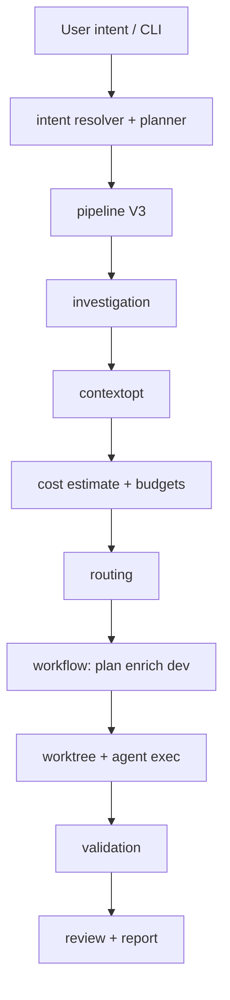

# Architecture overview

AgentFlow is a Go CLI (`application/cmd/agentflow`) with domain logic in `application/internal/` and shared types in `application/pkg/agentflow`.

## Execution pipeline

## Internal modules

| Package | Role |
| --- | --- |
| `cli` | Cobra commands, docgen, app context |
| `config` | YAML load, defaults, path resolve |
| `intent` | NL `work`/`continue`, hybrid resolver, executor |
| `workflow` | State machine, plan/dev/verify/review, worktrees |
| `worktree` | Git worktree lifecycle |
| `agent` / `agent/exec` | Subprocess contracts |
| `source` / `source/notion` | Spec ingestion |
| `contextopt` | Context collect/reduce/pack |
| `investigation` | Local grep/scan |
| `cost` | Tokens, pricing, budgets |
| `routing` | Step-class → agent/model |
| `mcp` | Stdio MCP tools (optional) |
| `store/sqlite` | Runs, tasks, metrics |
| `report` | Run reports |
| `tui` | Rich/plain/json UI |
| `rag` | Chunk index (SQLite, non-vector) |
| `bootstrap` | `init`, `doctor` |
| `redact` | Log secret masking |
| `validation` | External command runner |

## State storage

- **SQLite** at `state.path` (default `.agentflow/state.sqlite`)
- Run artefacts: `.agentflow/runs/<run-id>/`

## Extension points

- New agents: config only
- New validation commands: `validation.commands`
- Custom routing strategies: `routing.strategies`
- MCP tools when `mcp.enabled: true`

## Related

- [Configuration](/docs/configuration/config-file)
- [Reliability: worktrees](/docs/reliability/worktree-isolation)
- [MCP overview](/docs/mcp/overview)
