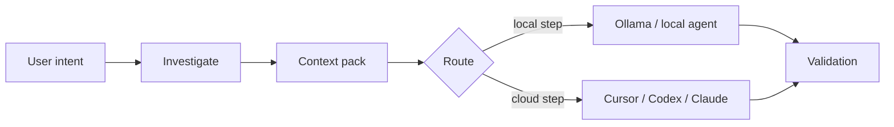

# Local-first workflows

## Problem

Sending entire repositories to cloud models is slow, expensive, and leaky. Most engineering questions can be narrowed with **local tools**: search, file scan, symbol lookup, and structured context packing.

## AgentFlow approach

Before expensive agent steps, AgentFlow can:

1. **`agentflow investigate <feature>`** — bounded grep, candidate files, large-file warnings, related tests
2. **`agentflow context <feature> --optimize`** — collect, score, compress context into a pack
3. **Routing** — prefer Ollama/local profiles for summarize, classify, `pre_review`, `context_selection` (see `routing.strategies.cost_aware`)



## Example

```bash
agentflow investigate billing-v2 --task task-003
agentflow context billing-v2 --task task-003 --optimize
agentflow work "develop billing-v2" --prefer-local --estimate-only
```

## Trade-offs

| Improves | Does not solve |
| --- | --- |
| Latency and cost for triage | Semantic understanding equal to a large cloud model |
| Repeatable investigation logs | Perfect relevance ranking (heuristic scoring) |
| Offline-capable steps with Ollama | Air-gapped compliance without your own review |

## Configuration

```yaml
routing:
  default_strategy: cost_aware
  strategies:
    cost_aware:
      prefer_local_for: [summarize, classify, context_selection, pre_review]

mcp:
  investigation:
    large_file_bytes: 524288
    max_grep_output_bytes: 262144
```

Investigation limits apply even when `mcp.enabled` is false — they are shared config under `mcp.investigation`.

## Related

- [Local investigation](/docs/cost-performance/local-investigation)
- [Context optimization](/docs/cost-performance/context-optimization)
- [Token estimation](/docs/cost-performance/token-estimation)
