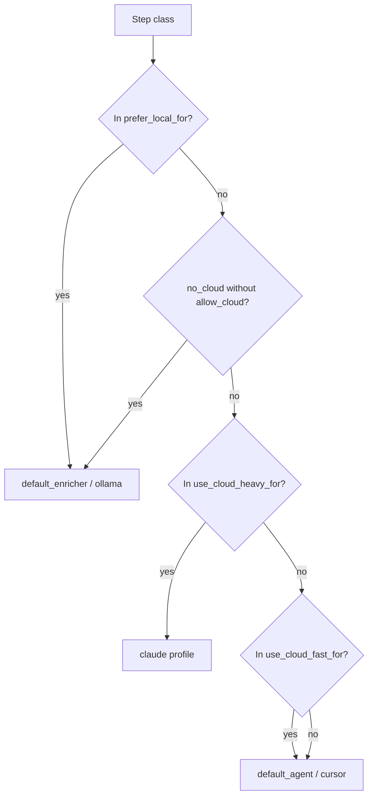

# Routing

`application/internal/routing/router.go` selects agent/model from config using step class strings (e.g. `summarize`, `implementation`, `pre_review`).

## Configuration

```yaml
routing:
  default_strategy: cost_aware
  strategies:
    cost_aware:
      prefer_local_for: [summarize, classify, context_selection, pre_review, log_analysis]
      use_cloud_fast_for: [implementation_medium, review_medium, planning_complex]
      use_cloud_heavy_for: [architecture_critical, security_sensitive, large_refactor]
      local_failures_before_cloud: 1
      cloud_fast_failures_before_heavy: 1
```

## Decision flow



## CLI overrides

| Flag | Effect |
| --- | --- |
| `--prefer-local` | Force local path when strategy matches |
| `--no-cloud` | Block cloud unless paired with `--allow-cloud` |
| `--allow-cloud` | Explicit cloud permission |

<Callout type="experimental">
Cloud routing quality depends entirely on your `models` and `agents` entries — AgentFlow does not call vendor APIs to pick models automatically.
</Callout>

## Related

- [Cost-aware concepts](/docs/concepts/cost-aware-workflows)
- [Models in config file](/docs/configuration/config-file#models)
