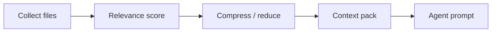

# Context optimization

Packages: `application/internal/contextopt` — collector, relevance scoring, reducer/compressor, packer.

## Pipeline



## CLI

```bash
agentflow context billing-v2 --task task-003
agentflow context billing-v2 --task task-003 --optimize
agentflow work "develop billing-v2" --show-context-plan
```

`work` runs context optimization in the V3 pipeline unless `--no-context-reduction` is set.

## Configuration

Investigation limits (shared with local grep) live under `mcp.investigation` in config — they apply even when MCP server is disabled.

## Trade-offs

| Benefit | Limit |
| --- | --- |
| Smaller prompts | May drop relevant files if heuristics miss |
| Faster cloud calls | Not a substitute for reading critical paths manually |

<Callout type="experimental">
Automatic compression heuristics evolve — compare `--show-context-plan` output when debugging missed context.
</Callout>

## Related

- [Local-first](/docs/concepts/local-first)
- [CLI: context](/docs/cli/generated/context)
