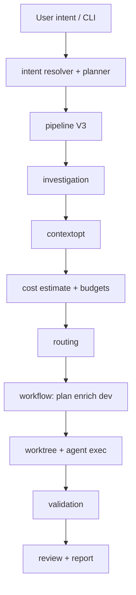

# Architektur-Übersicht

AgentFlow ist eine Go-CLI (`application/cmd/agentflow`). Das meiste Verhalten liegt in `application/internal/`, gemeinsame Verträge in `application/pkg/agentflow`. Diese Aufteilung hält das Binary überschaubar und bündelt Parsing, Planung, Untersuchung, Kosten und Persistenz in Packages, deren Rolle Sie allein aus der Ordnerstruktur ableiten können.

## Ausführungs-Pipeline

Der End-to-End-Pfad startet an der CLI, löst Intent auf und durchläuft die V3-Pipeline (Untersuchung, Kontextoptimierung, Kosten und Budgets, Routing). Anschließend laufen die Workflow-Stufen — plan, enrich, dev — in einem Worktree, gefolgt von Validierung, optionalem Review und Report.

## Interne Module

| Package | Rolle |
| --- | --- |
| `cli` | Cobra-Befehle, Docgen, App-Kontext |
| `config` | YAML-Laden, Defaults, Pfadauflösung |
| `intent` | NL `work`/`continue`, Hybrid-Resolver, Executor |
| `workflow` | State Machine, plan/dev/verify/review, Worktrees |
| `worktree` | Git-Worktree-Lebenszyklus |
| `agent` / `agent/exec` | Subprocess-Verträge |
| `source` / `source/notion` | Spec-Ingestion |
| `contextopt` | Kontext sammeln/reduzieren/packen |
| `investigation` | Lokales grep/scan |
| `cost` | Tokens, Pricing, Budgets |
| `routing` | Schrittklasse → Agent/Modell |
| `mcp` | Stdio-MCP-Tools (optional) |
| `store/sqlite` | Runs, Tasks, Metriken |
| `report` | Run-Reports |
| `tui` | Rich/plain/json-UI |
| `rag` | Chunk-Index (SQLite, nicht-vektoriell) |
| `bootstrap` | `init`, `doctor` |
| `redact` | Secret-Masking in Logs |
| `validation` | Externer Befehls-Runner |

## Zustandsspeicher

Runs und Tasks werden in **SQLite** unter `state.path` persistiert (Standard `.agentflow/state.sqlite`). Artefakte pro Run liegen unter `.agentflow/runs/<run-id>/`, sodass Prompts, Logs und Zwischenergebnisse ohne erneutes Auslesen der Datenbank auffindbar bleiben.

## Erweiterungspunkte

Sie können neue Agenten über die Konfiguration einbinden, Qualitätsgates über `validation.commands` verdrahten, Routing-Strategien unter `routing.strategies` ergänzen und — wenn `mcp.enabled: true` — optionale MCP-Tools bereitstellen. Das sind bewusste Nahtstellen: Die meisten Teams erweitern AgentFlow, ohne den Go-Einstieg zu forken.

## Siehe auch

- [Konfigurationsdatei](/docs/de/configuration/config-file)
- [Zuverlässigkeit: Worktrees](/docs/de/reliability/worktree-isolation)
- [MCP-Übersicht](/docs/de/mcp/overview)
