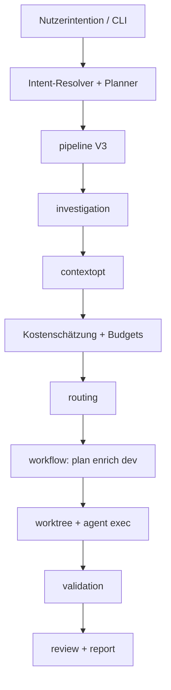

# Architekturüberblick

AgentFlow ist eine Go-CLI (`application/cmd/agentflow`) mit Domänenlogik in `application/internal/` und gemeinsamen Typen in `application/pkg/agentflow`.

## Ausführungs-Pipeline

## Interne Module

| Paket | Rolle |
| --- | --- |
| `cli` | Cobra-Befehle, Docgen, App-Kontext |
| `config` | YAML-Laden, Defaults, Pfadauflösung |
| `intent` | NL `work`/`continue`, Hybrid-Resolver, Executor |
| `workflow` | Zustandsmaschine, plan/dev/verify/review, Worktrees |
| `worktree` | Git-Worktree-Lebenszyklus |
| `agent` / `agent/exec` | Subprocess-Verträge |
| `source` / `source/notion` | Spec-Ingestion |
| `contextopt` | Kontext sammeln/reduzieren/packen |
| `investigation` | Lokales grep/Scan |
| `cost` | Token, Pricing, Budgets |
| `routing` | Schrittklasse → Agent/Modell |
| `mcp` | stdio-MCP-Tools (optional) |
| `store/sqlite` | Läufe, Aufgaben, Metriken |
| `report` | Lauf-Reports |
| `tui` | rich/plain/json-UI |
| `rag` | Chunk-Index (SQLite, nicht vektoriel) |
| `bootstrap` | `init`, `doctor` |
| `redact` | Log-Secret-Masking |
| `validation` | externer Befehls-Runner |

## Zustandsspeicherung

- **SQLite** bei `state.path` (Standard `.agentflow/state.sqlite`)
- Lauf-Artefakte: `.agentflow/runs/<run-id>/`

## Erweiterungspunkte

- neue Agents: nur Config
- neue Validierungsbefehle: `validation.commands`
- eigene Routing-Strategien: `routing.strategies`
- MCP-Tools bei `mcp.enabled: true`

## Siehe auch

- [Konfiguration](/docs/de/configuration/config-file)
- [Zuverlässigkeit: Worktrees](/docs/de/reliability/worktree-isolation)
- [MCP-Überblick](/docs/de/mcp/overview)
