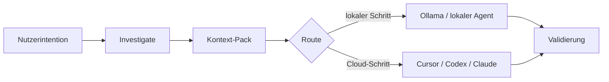

# Lokal-zuerst-Workflows

## Problem

Ganze Repositories an Cloud-Modelle zu senden ist langsam, teuer und leckageanfällig. Die meisten technischen Fragen lassen sich mit **lokalen Werkzeugen** eingrenzen: Suche, Dateiscan, Symbol-Lookup und strukturiertes Kontext-Packing.

## AgentFlow-Ansatz

Vor teuren Agent-Schritten kann AgentFlow:

1. **`agentflow investigate <feature>`** — begrenztes grep, Kandidatendateien, Warnungen bei großen Dateien, zugehörige Tests
2. **`agentflow context <feature> --optimize`** — sammeln, bewerten, Kontext in ein Pack komprimieren
3. **Routing** — Ollama/lokale Profile für summarize, classify, `pre_review`, `context_selection` bevorzugen (siehe `routing.strategies.cost_aware`)



## Beispiel

```bash
agentflow investigate billing-v2 --task task-003
agentflow context billing-v2 --task task-003 --optimize
agentflow work "develop billing-v2" --prefer-local --estimate-only
```

## Kompromisse

| Verbessert | Löst nicht |
| --- | --- |
| Latenz und Kosten beim Triage | semantisches Verständnis wie ein großes Cloud-Modell |
| Wiederholbare Untersuchungslogs | perfekte Relevanz-Rankings (heuristische Bewertung) |
| Offline-fähige Schritte mit Ollama | Air-Gap-Compliance ohne eigene Review |

## Konfiguration

```yaml
routing:
  default_strategy: cost_aware
  strategies:
    cost_aware:
      prefer_local_for: [summarize, classify, context_selection, pre_review]

mcp:
  investigation:
    large_file_bytes: 524288
    max_grep_output_bytes: 262144
```

Untersuchungsgrenzen gelten auch bei `mcp.enabled: false` — gemeinsame Konfiguration unter `mcp.investigation`.

## Siehe auch

- [Lokale Untersuchung](/docs/de/cost-performance/local-investigation)
- [Kontext-Optimierung](/docs/de/cost-performance/context-optimization)
- [Token-Schätzung](/docs/de/cost-performance/token-estimation)
