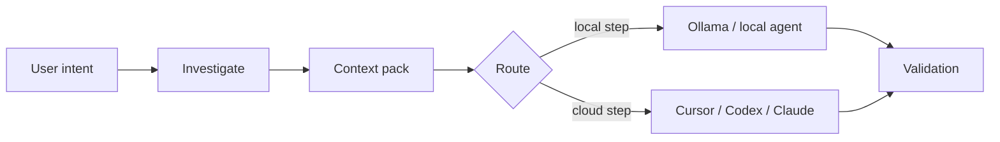

# Local-first-Workflows

## Problem

Ein ganzes Repository durch ein Cloud-Modell zu schicken ist langsam, teuer und gibt oft mehr Code preis als die Aufgabe erfordert. Viele technische Fragen werden kleiner, sobald Sie den Baum durchsuchen, Kandidatendateien listen und strukturiert packen — Arbeit, die auf Ihrer Maschine mit gewöhnlichen Tools hingehört, nicht in einem Remote-Prompt.

## AgentFlows Ansatz

**Lokale Untersuchung und Kontextreduktion** sind ein erstklassiger Schritt vor den teuren Phasen. AgentFlow kann vorher eingrenzen, was das Repository verlässt:

1. **`agentflow investigate <feature>`** — begrenztes Grep, Kandidatendateien, Warnungen bei großen Dateien, zugehörige Tests
2. **`agentflow context <feature> --optimize`** — Kontext sammeln, bewerten, in ein Pack verdichten
3. **Routing** — Ollama oder lokale Profile für `summarize`, `classify`, `pre_review` und `context_selection`, wenn `routing.strategies.cost_aware` greift

Praktisch verläuft das linear: Nutzerintent → Untersuchung → Kontext-Pack → Routing wählt lokal oder Cloud → beide Pfade laufen in die Validierung.



## Beispiel

Untersuchung und Kontextoptimierung für ein Feature, dann Vorschau von `work` mit lokaler Präferenz und nur Schätzung:

```bash
agentflow investigate billing-v2 --task task-003
agentflow context billing-v2 --task task-003 --optimize
agentflow work "develop billing-v2" --prefer-local --estimate-only
```

## Abwägungen

| Verbessert | Löst nicht |
| --- | --- |
| Latenz und Kosten beim Triage | Semantische Tiefe eines großen Cloud-Modells |
| Reproduzierbare Untersuchungs-Logs | Perfektes Relevanz-Ranking (Heuristiken) |
| Offline-fähige Schritte mit Ollama | Compliance ohne eigenes Review |

## Konfiguration

Das folgende Snippet aktiviert kostenbewusstes Routing und setzt gemeinsame Byte-Limits für die Investigation. Die Limits gelten auch bei `mcp.enabled: false`; sie stehen unter `mcp.investigation`, weil sie von allen lokalen Investigation-Pfaden geteilt werden.

```yaml
routing:
  default_strategy: cost_aware
  strategies:
    cost_aware:
      prefer_local_for: [summarize, classify, context_selection, pre_review]

mcp:
  investigation:
    large_file_bytes: 524288
    max_grep_output_bytes: 262144
```

## Siehe auch

- [Lokale Investigation](/docs/de/cost-performance/local-investigation)
- [Kontextoptimierung](/docs/de/cost-performance/context-optimization)
- [Token-Schätzung](/docs/de/cost-performance/token-estimation)
