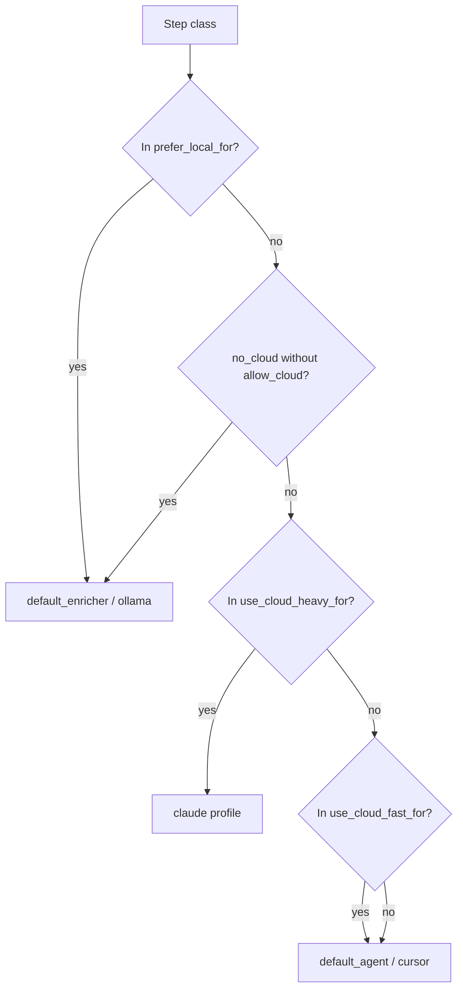

# Routing

`application/internal/routing/router.go` ordnet jedem Schritt einen Agent und ein Modell über **Schrittklassen** wie `summarize`, `implementation` oder `pre_review` zu. Der Router liest `routing` aus `config.yaml`. Es gibt keine „Telefonate“ zu Anbietern, um Modelle zu „finden“ — **`models` und `agents` in Ihrer YAML sind maßgeblich.**

## Konfiguration

Strategien bündeln Präferenzen: welche Klassen lokal bleiben, welche ein schnelles Cloud-Profil rechtfertigen, welche ein schwereres Profil, und wie viele Fehlversuche einen Fallback auslösen.

```yaml
routing:
  default_strategy: cost_aware
  strategies:
    cost_aware:
      prefer_local_for: [summarize, classify, context_selection, pre_review, log_analysis]
      use_cloud_fast_for: [implementation_medium, review_medium, planning_complex]
      use_cloud_heavy_for: [architecture_critical, security_sensitive, large_refactor]
      local_failures_before_cloud: 1
      cloud_fast_failures_before_heavy: 1
```

## Entscheidungsfluss

Das Diagramm entspricht der Reihenfolge im Code: lokale Präferenz zuerst, dann Cloud-Sperren, dann schwere gegenüber schnellen Cloud-Buckets, mit Fallbacks, wenn keine Liste exakt passt.



## CLI-Overrides

Dieselbe Entscheidungslogik ohne YAML zu ändern: lokal erzwingen, wo die Strategie es erlaubt; Cloud nur mit ausdrücklicher Erlaubnis.

| Flag | Wirkung |
| --- | --- |
| `--prefer-local` | Erzwingt den lokalen Pfad, wenn die Strategie passt |
| `--no-cloud` | Blockiert Cloud, außer zusammen mit `--allow-cloud` |
| `--allow-cloud` | Explizite Erlaubnis für Cloud-Routing |

<Callout type="experimental">
Die Qualität des Cloud-Routings hängt vollständig von Ihren Einträgen in `models` und `agents` ab — Asagiri wählt keine Modelle automatisch per Vendor-API.
</Callout>

## Verwandtes

- [Kostenbewusste Konzepte](/docs/de/concepts/cost-aware-workflows)
- [Modelle in der Konfigurationsdatei](/docs/de/configuration/config-file#models)
