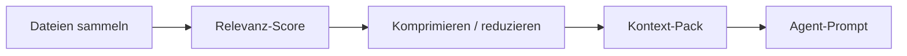

# Kontext-Optimierung

Pakete: `application/internal/contextopt` — Collector, Relevanz-Score, Reducer/Kompressor, Packer.

## Pipeline



## CLI

```bash
agentflow context billing-v2 --task task-003
agentflow context billing-v2 --task task-003 --optimize
agentflow work "develop billing-v2" --show-context-plan
```

`work` führt Kontextoptimierung in der V3-Pipeline aus, sofern nicht `--no-context-reduction` gesetzt ist.

## Konfiguration

Untersuchungsgrenzen (geteilt mit lokalem grep) stehen unter `mcp.investigation` — sie gelten auch bei deaktiviertem MCP-Server.

## Kompromisse

| Vorteil | Grenze |
| --- | --- |
| kleinere Prompts | kann relevante Dateien verlieren, wenn Heuristiken versagen |
| schnellere Cloud-Calls | kein Ersatz für manuelles Lesen kritischer Pfade |

<Callout type="experimental">
Kompressionsheuristiken entwickeln sich — vergleichen Sie `--show-context-plan`, wenn Kontext fehlt.
</Callout>

## Siehe auch

- [Lokal zuerst](/docs/de/concepts/local-first)
- [CLI: context](/docs/cli/generated/context)
