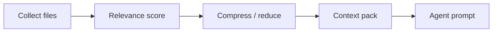

# Kontextoptimierung

Implementiert in `application/internal/contextopt`: Ein Collector sammelt Kandidaten, ein Relevanz-Scorer sortiert sie, Reduktion oder Kompression entfernt wenig wertvollen Inhalt, ein Packer erzeugt das Blob, das Agenten tatsächlich sehen. Ziel sind **kleinere, präziser zielende** Kontexte für kostenpflichtige APIs bei weiterhin über die CLI nachvollziehbaren Regeln.

## Pipeline



## CLI

```bash
asa context billing-v2 --task task-003
asa context billing-v2 --task task-003 --optimize
asa work "develop billing-v2" --show-context-plan
```

`work` führt in der V3-Pipeline die Kontextoptimierung aus, sofern nicht `--no-context-reduction` gesetzt ist.

## Konfiguration

Die Byte-Limits für Grep und große Dateien werden mit der lokalen Investigation geteilt; sie stehen unter `mcp.investigation` und gelten **auch**, wenn der MCP-Server ausgeschaltet ist — sie begrenzen dieselbe lokale Werkzeugschicht, die den Collector speist.

## Abwägungen

| Vorteil | Grenze |
| --- | --- |
| Kleinere Prompts | Kann relevante Dateien auslassen, wenn Heuristiken daneben greifen |
| Schnellere Cloud-Aufrufe | Ersetzt nicht das bewusste Lesen kritischer Pfade |

<Callout type="experimental">
Kompressionsheuristiken entwickeln sich — beim Debuggen fehlenden Kontexts Ausgaben von `--show-context-plan` vergleichen.
</Callout>

## Verwandtes

- [Local-first-Konzepte](/docs/de/concepts/local-first)
- [CLI: context](/docs/de/cli/generated/context)
