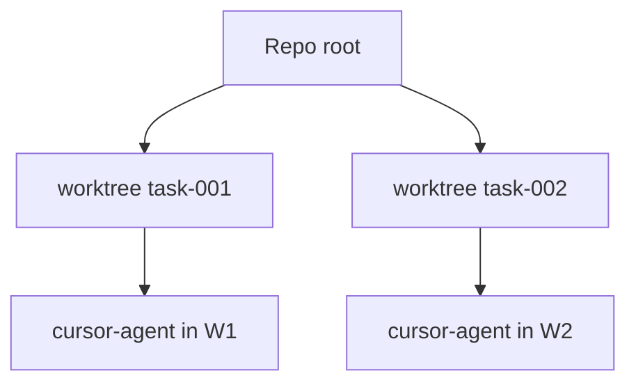

# Worktree-Isolation

Implementierung in **`application/internal/worktree`**. Aktiv wird sie, wenn **`workflow.Service.DevFeature`** für **`dev`** eine isolierte Arbeitsumgebung bereitstellt.

## Verhalten

Die Isolation bleibt nachvollziehbar:

1. Pro Aufgabe legt Asagiri einen Worktree unter `worktrees.base_path` an
2. Der Branchname setzt sich aus `worktrees.branch_prefix` und Feature- bzw. Task-ID zusammen
3. Agent-Subprozesse erhalten als Arbeitsverzeichnis den Pfad des Worktrees
4. `asa clean` entfernt Worktrees entsprechend `cleanup_policy`

```yaml
worktrees:
  base_path: .asagiri/worktrees
  branch_prefix: asa
  cleanup_policy: keep_failed   # keep_failed | always | ...
```

## Diagramm

Parallele Aufgaben verzweigen sich vom kanonischen Checkout aus; sie teilen sich nicht unbeabsichtigt denselben „schmutzigen“ Arbeitsbaum.



## Dry-run

Mit `--dry-run` kann die Worktree-Erzeugung übersprungen oder simuliert werden — etwa damit CI keine kurzlebigen Branches anlegt, wenn nur das Verhalten getestet wird.

## Richtlinien

**`policies.max_files_changed_per_task`** mit menschlicher Review vor dem Merge kombinieren — der Schalter begrenzt das Ausmaß möglicher Änderungen, ersetzt aber keine inhaltliche Prüfung.

## Verwandtes

- [Recovery bei Fehlern](/docs/de/workflows/failure-recovery)
- [CLI: clean](/docs/de/cli/generated/clean)
- [CLI: dev](/docs/de/cli/generated/dev)
