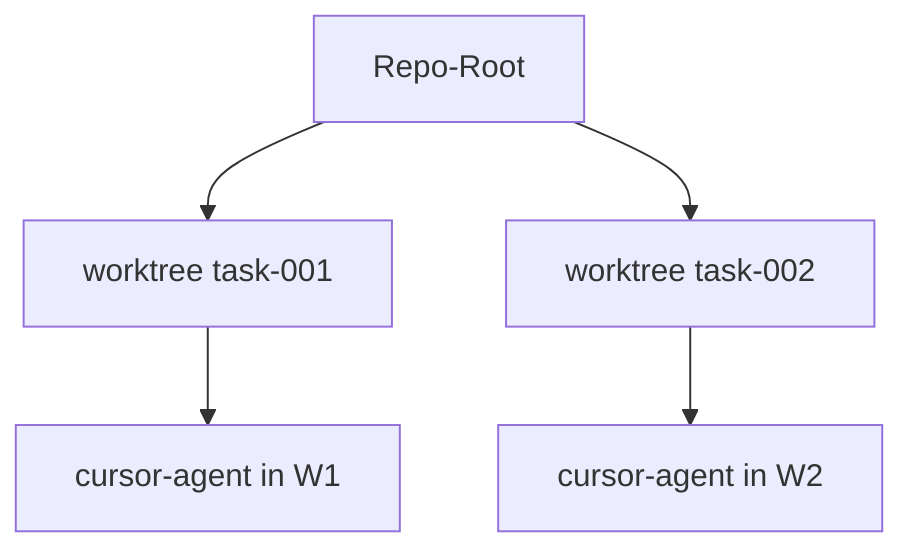

# Worktree-Isolation

Implementierung: `application/internal/worktree` — erzeugt während `dev` in `workflow.Service.DevFeature`.

## Verhalten

1. Pro Aufgabe erstellt AgentFlow einen Worktree unter `worktrees.base_path`
2. Branch-Name nutzt `worktrees.branch_prefix` + Feature-/Task-ID
3. Agent-Subprozesse laufen mit `WorkingDir` auf dem Worktree-Pfad
4. `agentflow clean` entfernt Worktrees gemäß `cleanup_policy`

```yaml
worktrees:
  base_path: .agentflow/worktrees
  branch_prefix: agentflow
  cleanup_policy: keep_failed   # keep_failed | always | ...
```

## Diagramm



## Dry-run

Mit `--dry-run` wird Worktree-Erstellung übersprungen oder simuliert — Integrationstests nutzen das für CI-sichere Läufe.

## Richtlinien

`policies.max_files_changed_per_task` begrenzt die Blast-Radius; kombinieren Sie mit menschlicher Review vor dem Merge.

## Siehe auch

- [Fehlerbehebung](/docs/de/workflows/failure-recovery)
- [CLI: clean](/docs/cli/generated/clean)
- [CLI: dev](/docs/cli/generated/dev)
