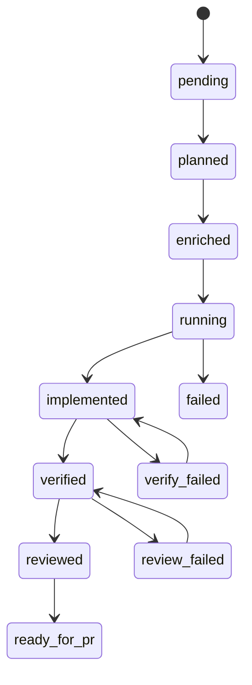

# Recovery bei Fehlern

AgentFlow speichert **explizite Aufgabenstatus** statt Fortschritt aus verstreuten Dateien zu rekonstruieren. Sauberes Wiederanlaufen bedeutet, diese Übergänge zu respektieren — oder dokumentierte Ausnahmen wie `--force` und Hilfsbefehle zur Wiederaufnahme zu nutzen, wo der Orchestrator Wiederholungen erlaubt.

## Zustandsautomat

Aufgaben durchlaufen klare Statuswerte in `workflow/state_machine.go`:



Ungültige Übergänge liefern Fehler, es sei denn, der jeweilige Befehl erlaubt `--force` für diese Transition.

## Häufige Wiederanlauf-Rezepte

### Verifikation fehlgeschlagen

Code im zugehörigen Worktree korrigieren, dann erneut verifizieren:

```bash
agentflow verify billing-v2 --force
```

### Review fehlgeschlagen

```bash
agentflow review billing-v2 --agent codex --force
```

### Unterbrochener Lauf

```bash
agentflow status
agentflow resume <run-id>          # gibt den nächsten Schritt aus: plan | enrich | dev | verify | review
agentflow continue "resume billing-v2"
```

<Callout type="experimental">
`agentflow resume <run-id> --execute` verketten Schritte nur zusammen mit globalem **`--dry-run`**. Ohne Dry-Auto werden Agenten nicht automatisch erneut gestartet — den ausgegebenen Schritt manuell ausführen oder `continue` verwenden.
</Callout>

### Veraltete Worktrees entfernen

```bash
agentflow clean
```

Entfernt Worktrees gemäß `worktrees.cleanup_policy` (`keep_failed` behält Trees fehlgeschlagener Aufgaben).

## Reports für die Nachbereitung

Für Analyse im Nachhinein oder Abgleich mit Reviewern stehen **`report`** und zusammenfassende **`investigate`**-Ausgaben zur Verfügung:

```bash
agentflow report <run-id>
agentflow investigate billing-v2
```

## Verwandtes

- [Worktree-Isolation](/docs/de/reliability/worktree-isolation)
- [CLI: resume](/docs/de/cli/generated/resume)
- [CLI: continue](/docs/de/cli/generated/continue)
