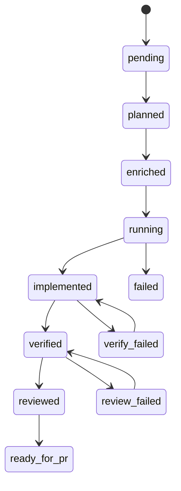

# Fehlerbehebung und Recovery

## Zustandsmaschine

Aufgaben durchlaufen explizite Status, erzwungen in `workflow/state_machine.go`:



Ungültige Übergänge liefern Fehler, außer `--force` ist für den konkreten Befehl erlaubt.

## Typische Wiederherstellung

### Verify fehlgeschlagen

```bash
# Code im Worktree fixen, dann:
agentflow verify billing-v2 --force
```

### Review fehlgeschlagen

```bash
agentflow review billing-v2 --agent codex --force
```

### Unterbrochener Lauf

```bash
agentflow status
agentflow resume <run-id>          # nächster Schritt: plan|enrich|dev|verify|review
agentflow continue "resume billing-v2"   # intentionsbasierte Fortsetzung
```

<Callout type="experimental">
`agentflow resume <run-id> --execute` verkettet Schritte nur mit globalem **`--dry-run`**. Außerhalb von Dry-Run ruft `resume` keine Agenten automatisch auf — führen Sie den gedruckten Schritt manuell aus oder nutzen Sie `continue`.
</Callout>

### Veraltete Worktrees aufräumen

```bash
agentflow clean
```

Entfernt Worktrees gemäß `worktrees.cleanup_policy` (`keep_failed` behält fehlgeschlagene Task-Trees).

## Reports für Post-Mortems

```bash
agentflow report <run-id>
agentflow investigate billing-v2
```

## Siehe auch

- [Worktree-Isolation](/docs/de/reliability/worktree-isolation)
- [CLI: resume](/docs/cli/generated/resume)
- [CLI: continue](/docs/cli/generated/continue)
