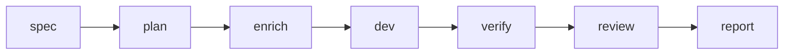

# Kiro → Cursor → Verify

Dieser Arbeitsablauf entspricht **`spec-doc` §11.2** mit den Asagiri-Gates: Anforderungen und Aufgaben bleiben in **Kiro** unter `.kiro/specs/<feature>/`; die Umsetzung nutzt **Cursor** oder **`cursor-agent`** dort, wo diese Tools stark sind; die CLI erzwingt deterministische **`verify`**- und **`review`**-Schritte, damit Automation nicht still nebenläufig abweicht.

## Wann der Ablauf passt

Sie pflegen `.kiro/specs/<feature>/`, möchten für die Implementierung **Cursor** (`cursor-agent`) verwenden und halten Verifikation sowie Review für verbindlich.

## Pipeline

Illustrative Reihenfolge — konkrete Run-IDs entnehmen Sie weiterhin der persistenten Ausführung:



## Befehle

`billing-v2` durch Ihre Feature-ID ersetzen:

```bash
asa spec billing-v2 --agent kiro
asa plan billing-v2
asa enrich billing-v2 --agent ollama
asa dev billing-v2 --agent cursor
asa verify billing-v2
asa review billing-v2 --agent codex
asa report <run-id>
```

Einzelne Schritte mit `--dry-run` probieren:

```bash
asa dev billing-v2 --agent cursor --dry-run
```

## Konfigurationsvorgaben

Aus `.asagiri/config.yaml.example`:

```yaml
work:
  default_agent: cursor
  default_reviewer: codex
  default_enricher: ollama
  auto_verify: true
  auto_review: false
```

`work.auto_review: true` nur setzen, wenn nach jedem erfolgreichen Verify automatisch ein Review laufen soll.

## Abkürzung über Intent

```bash
asa work "develop billing-v2" --stop-after verify
```

Die Intent-Auflösung wählt das Feature; die V3-Pipeline wendet Budgets und Kontextoptimierung an.

## Typische Störungen

| Symptom | Vorgehen |
| --- | --- |
| `kiro` nicht auf `PATH` | `agents.kiro.command` setzen oder Kiro-CLI installieren |
| Verify schlägt fehl | Tests lokal beheben; `asa verify billing-v2 --force` nur, wenn die State Machine es erlaubt |
| Dirty-Git-Blockade | Committen oder stashen — oder `policies.require_clean_git` bewusst anpassen |

## Verwandtes

- [CLI: spec](/docs/de/cli/generated/spec)
- [CLI: dev](/docs/de/cli/generated/dev)
- [Architektur-Übersicht](/docs/de/architecture/overview)
