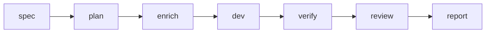

# Kiro → Cursor → Verify

Übergabe-Workflow von Kiro-Specs zur Cursor-Implementierung mit AgentFlow-Gates (`spec-doc` §11.2).

## Wann einsetzen

Sie pflegen Anforderungen und Aufgaben in **Kiro** (`.kiro/specs/<feature>/`), wollen aber **Cursor** (oder `cursor-agent`) für die Implementierung mit obligatorischen Verify-/Review-Schritten.

## Pipeline



## Befehle

`billing-v2` durch Ihre Feature-ID ersetzen:

```bash
agentflow spec billing-v2 --agent kiro
agentflow plan billing-v2
agentflow enrich billing-v2 --agent ollama
agentflow dev billing-v2 --agent cursor
agentflow verify billing-v2
agentflow review billing-v2 --agent codex
agentflow report <run-id>
```

`--dry-run` bei jedem Schritt während der Probe:

```bash
agentflow dev billing-v2 --agent cursor --dry-run
```

## Konfigurations-Defaults

Aus `.agentflow/config.yaml.example`:

```yaml
work:
  default_agent: cursor
  default_reviewer: codex
  default_enricher: ollama
  auto_verify: true
  auto_review: false
```

`work.auto_review: true` nur setzen, wenn nach jedem erfolgreichen Verify eine Review gewünscht ist.

## Intent-Shortcut

```bash
agentflow work "develop billing-v2" --stop-after verify
```

Intent-Auflösung wählt das Feature; V3-Pipeline wendet Budgets und Kontextoptimierung an.

## Fehlerbilder

| Symptom | Abhilfe |
| --- | --- |
| `kiro` nicht im PATH | `agents.kiro.command` setzen oder Kiro-CLI installieren |
| Verify schlägt fehl | Tests lokal fixieren; `agentflow verify billing-v2 --force` nur wenn Zustandsmaschine es erlaubt |
| Dirty Git blockiert | Commit/stash oder `policies.require_clean_git` anpassen |

## Siehe auch

- [CLI: spec](/docs/cli/generated/spec)
- [CLI: dev](/docs/cli/generated/dev)
- [Architekturüberblick](/docs/de/architecture/overview)
