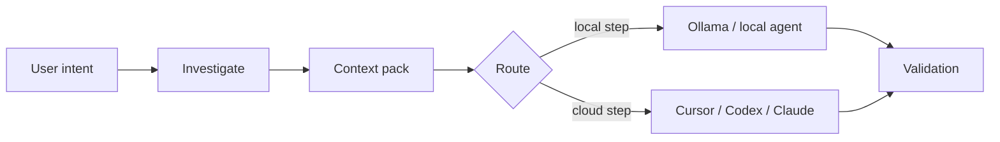

# Local-first workflows

## Problem

Pushing an entire repository through a cloud model is slow, expensive, and often leaks more code than the task requires. Many engineering questions shrink once you search the tree, list candidate files, and apply structured packing—work that belongs on your machine with ordinary tools, not in a remote prompt.

## AgentFlow approach

AgentFlow treats **local investigation and context reduction** as a first-class prelude. Before the expensive steps, AgentFlow can narrow what leaves the repo:

1. **`agentflow investigate <feature>`** — bounded grep, candidate files, large-file warnings, related tests
2. **`agentflow context <feature> --optimize`** — collect, score, compress context into a pack
3. **Routing** — prefer Ollama or local profiles for `summarize`, `classify`, `pre_review`, and `context_selection` when `routing.strategies.cost_aware` is in play

The flow is linear in practice: the user's intent feeds investigation, investigation feeds a context pack, routing chooses local versus cloud execution, and both paths converge on validation.



## Example

The sequence below runs investigation and context optimization for a feature, then previews a `work` run with local preference and estimate-only:

```bash
agentflow investigate billing-v2 --task task-003
agentflow context billing-v2 --task task-003 --optimize
agentflow work "develop billing-v2" --prefer-local --estimate-only
```

## Trade-offs

| Improves | Does not solve |
| --- | --- |
| Latency and cost for triage | Semantic understanding equal to a large cloud model |
| Repeatable investigation logs | Perfect relevance ranking (heuristic scoring) |
| Offline-capable steps with Ollama | Air-gapped compliance without your own review |

## Configuration

The snippet below turns on cost-aware routing and sets shared investigation byte limits. Those limits apply even when `mcp.enabled` is false: they live under `mcp.investigation` as shared configuration for local tools.

```yaml
routing:
  default_strategy: cost_aware
  strategies:
    cost_aware:
      prefer_local_for: [summarize, classify, context_selection, pre_review]

mcp:
  investigation:
    large_file_bytes: 524288
    max_grep_output_bytes: 262144
```

## Related

- [Local investigation](/docs/cost-performance/local-investigation)
- [Context optimization](/docs/cost-performance/context-optimization)
- [Token estimation](/docs/cost-performance/token-estimation)
