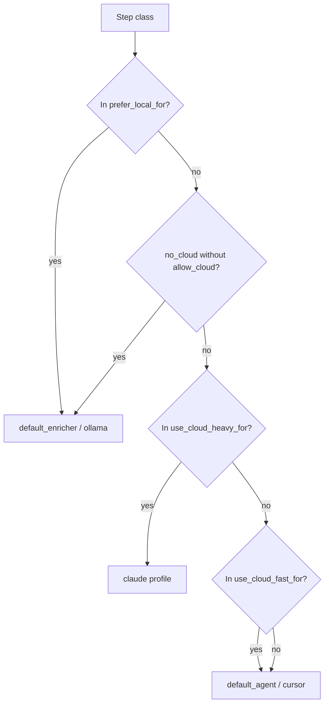

# Routing

`application/internal/routing/router.go` maps each step to an agent and model using **step class** strings such as `summarize`, `implementation`, or `pre_review`. The router consults `routing` in `config.yaml`; it does not phone home to vendors to “discover” models — your `models` and `agents` tables are the source of truth.

## Configuration

Strategies bundle preferences: which classes stay on local stack, which justify a fast cloud profile, which warrant a heavier one, and how many failures trigger a fallback path.

```yaml
routing:
  default_strategy: cost_aware
  strategies:
    cost_aware:
      prefer_local_for: [summarize, classify, context_selection, pre_review, log_analysis]
      use_cloud_fast_for: [implementation_medium, review_medium, planning_complex]
      use_cloud_heavy_for: [architecture_critical, security_sensitive, large_refactor]
      local_failures_before_cloud: 1
      cloud_fast_failures_before_heavy: 1
```

## Decision flow

The diagram mirrors the decision order in code: local preference first, then cloud blocking rules, then heavy versus fast cloud buckets, with sane fallbacks when a class does not match tightly.



## CLI overrides

These flags shift the same decision graph without editing YAML: force local when the strategy allows it, withhold cloud unless you pair permission flags explicitly.

| Flag | Effect |
| --- | --- |
| `--prefer-local` | Force local path when strategy matches |
| `--no-cloud` | Block cloud unless paired with `--allow-cloud` |
| `--allow-cloud` | Explicit cloud permission |

<Callout type="experimental">
Cloud routing quality depends entirely on your `models` and `agents` entries — AgentFlow does not call vendor APIs to pick models automatically.
</Callout>

## Related

- [Cost-aware concepts](/docs/concepts/cost-aware-workflows)
- [Models in config file](/docs/configuration/config-file#models)
