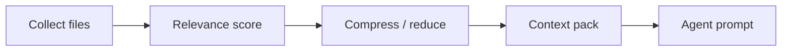

# Context optimization

Context optimization is implemented in `application/internal/contextopt`: a collector gathers candidate files, a relevance scorer ranks them, a reducer or compressor trims low-value material, and a packer emits the blob agents actually see. The intent is to send **smaller, better-targeted** context to paid APIs while keeping the reduction rules inspectable from the CLI.

## Pipeline



## CLI

```bash
asa context billing-v2 --task task-003
asa context billing-v2 --task task-003 --optimize
asa work "develop billing-v2" --show-context-plan
```

`work` runs context optimization in the V3 pipeline unless `--no-context-reduction` is set.

## Configuration

Investigation limits that cap grep output and large files are shared with local investigation: they live under `mcp.investigation` in config and **apply even when the MCP server is disabled**, because they govern the local tooling that feeds the collector.

## Trade-offs

| Benefit | Limit |
| --- | --- |
| Smaller prompts | May drop relevant files if heuristics miss |
| Faster cloud calls | Not a substitute for reading critical paths manually |

<Callout type="experimental">
Automatic compression heuristics evolve — compare `--show-context-plan` output when debugging missed context.
</Callout>

## Related

- [Local-first](/docs/concepts/local-first)
- [CLI: context](/docs/cli/generated/context)
