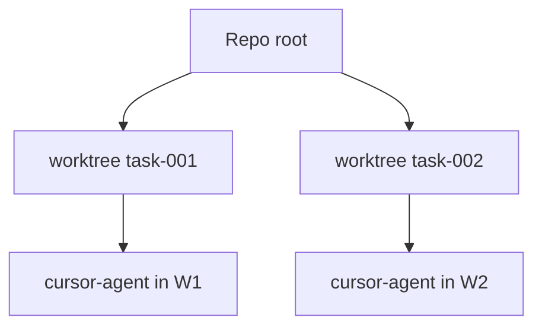

# Worktree isolation

Implementation lives in **`application/internal/worktree`**, spun up whenever **`workflow.Service.DevFeature`** provisions an isolated sandbox for **`dev`**.

## Behavior

Isolation stays predictable step by step:

1. For each task, Asagiri creates a worktree under `worktrees.base_path`
2. Branch name uses `worktrees.branch_prefix` + feature/task id
3. Agent subprocesses run with `WorkingDir` set to the worktree path
4. `asa clean` removes worktrees per `cleanup_policy`

```yaml
worktrees:
  base_path: .asagiri/worktrees
  branch_prefix: asa
  cleanup_policy: keep_failed   # keep_failed | always | ...
```

## Diagram

Concurrent tasks therefore fan out horizontally from the canonical repository checkout without sharing dirty working-tree state unintentionally:



## Dry-run

With `--dry-run`, worktree creation is skipped or simulated — integration tests rely on this for CI-safe runs, especially when shared pipelines must never materialize ephemeral branches unnecessarily.

## Policies

Combine **`policies.max_files_changed_per_task`** with human scrutiny before merges; the knob caps blast radius, not intellectual oversight.

## Related

- [Failure recovery](/docs/workflows/failure-recovery)
- [CLI: clean](/docs/cli/generated/clean)
- [CLI: dev](/docs/cli/generated/dev)
