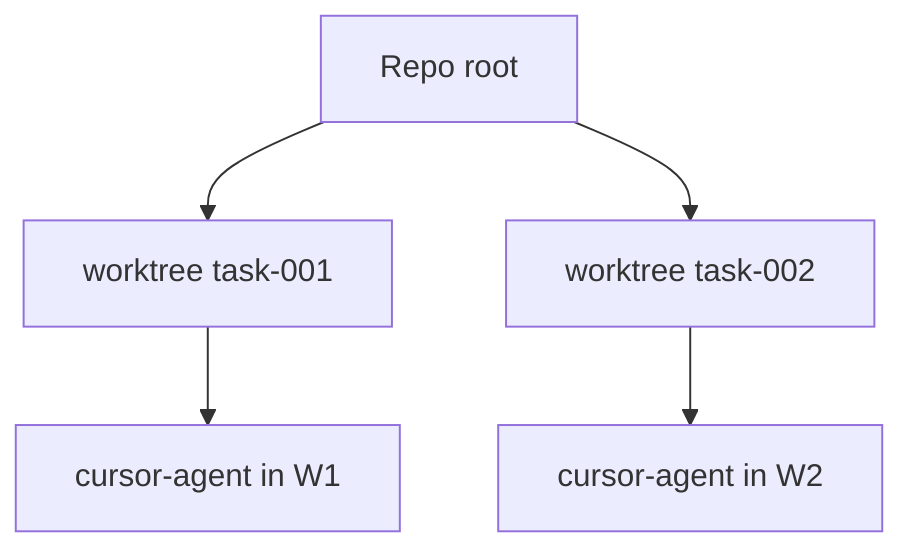

# Worktree isolation

Implementation: `application/internal/worktree` — created during `dev` in `workflow.Service.DevFeature`.

## Behavior

1. For each task, AgentFlow creates a worktree under `worktrees.base_path`
2. Branch name uses `worktrees.branch_prefix` + feature/task id
3. Agent subprocesses run with `WorkingDir` set to the worktree path
4. `agentflow clean` removes worktrees per `cleanup_policy`

```yaml
worktrees:
  base_path: .agentflow/worktrees
  branch_prefix: agentflow
  cleanup_policy: keep_failed   # keep_failed | always | ...
```

## Diagram



## Dry-run

With `--dry-run`, worktree creation is skipped or simulated — integration tests rely on this for CI-safe runs.

## Policies

`policies.max_files_changed_per_task` limits blast radius; combine with human review before merge.

## Related

- [Failure recovery](/docs/workflows/failure-recovery)
- [CLI: clean](/docs/cli/generated/clean)
- [CLI: dev](/docs/cli/generated/dev)
