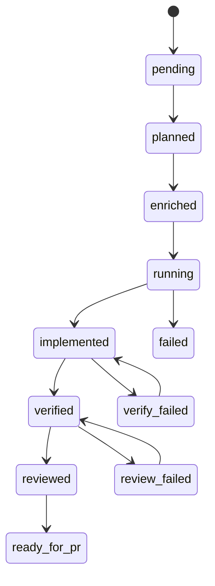

# Failure recovery

## State machine

Tasks move through explicit statuses enforced in `workflow/state_machine.go`:



Invalid transitions return errors unless `--force` is allowed on the specific command.

## Common recoveries

### Verify failed

```bash
# fix code in worktree, then:
agentflow verify billing-v2 --force
```

### Review failed

```bash
agentflow review billing-v2 --agent codex --force
```

### Interrupted run

```bash
agentflow status
agentflow resume <run-id>          # prints next step: plan|enrich|dev|verify|review
agentflow continue "resume billing-v2"   # intent-based continuation
```

<Callout type="experimental">
`agentflow resume <run-id> --execute` chains steps only with global **`--dry-run`**. Non-dry-run resume does not auto-invoke agents — run the printed step manually or use `continue`.
</Callout>

### Clean stale worktrees

```bash
agentflow clean
```

Removes worktrees according to `worktrees.cleanup_policy` (`keep_failed` keeps failed task trees).

## Reports for post-mortems

```bash
agentflow report <run-id>
agentflow investigate billing-v2
```

## Related

- [Worktree isolation](/docs/reliability/worktree-isolation)
- [CLI: resume](/docs/cli/generated/resume)
- [CLI: continue](/docs/cli/generated/continue)
