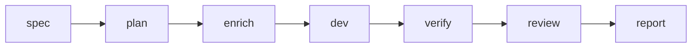

# Kiro → Cursor → Verify

Handoff workflow from Kiro specs to Cursor implementation with AgentFlow gates (`spec-doc` §11.2).

## When to use

You keep requirements and tasks in **Kiro** (`.kiro/specs/<feature>/`) but want **Cursor** (or `cursor-agent`) for implementation, with mandatory verify/review steps.

## Pipeline



## Commands

Replace `billing-v2` with your feature id:

```bash
agentflow spec billing-v2 --agent kiro
agentflow plan billing-v2
agentflow enrich billing-v2 --agent ollama
agentflow dev billing-v2 --agent cursor
agentflow verify billing-v2
agentflow review billing-v2 --agent codex
agentflow report <run-id>
```

Use `--dry-run` on any step while rehearsing:

```bash
agentflow dev billing-v2 --agent cursor --dry-run
```

## Configuration defaults

From `.agentflow/config.yaml.example`:

```yaml
work:
  default_agent: cursor
  default_reviewer: codex
  default_enricher: ollama
  auto_verify: true
  auto_review: false
```

Set `work.auto_review: true` only when you want review after every successful verify.

## Intent shortcut

```bash
agentflow work "develop billing-v2" --stop-after verify
```

Intent resolution picks the feature; V3 pipeline applies budgets and context optimization.

## Failure modes

| Symptom | Fix |
| --- | --- |
| `kiro` not on PATH | Set `agents.kiro.command` or install Kiro CLI |
| Verify fails | Fix tests locally; use `agentflow verify billing-v2 --force` only when state machine allows |
| Dirty git blocked | Commit/stash or adjust `policies.require_clean_git` |

## Related

- [CLI: spec](/docs/cli/generated/spec)
- [CLI: dev](/docs/cli/generated/dev)
- [Architecture overview](/docs/architecture/overview)
