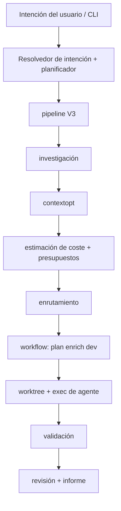

# Descripción general de la arquitectura

AgentFlow es una CLI en Go (`application/cmd/agentflow`) con lógica de dominio en `application/internal/` y tipos compartidos en `application/pkg/agentflow`.

## Pipeline de ejecución

## Módulos internos

| Paquete | Rol |
| --- | --- |
| `cli` | Comandos Cobra, docgen, contexto de la app |
| `config` | Carga YAML, valores por defecto, resolución de rutas |
| `intent` | NL `work`/`continue`, resolvedor híbrido, ejecutor |
| `workflow` | Máquina de estados, plan/dev/verify/review, worktrees |
| `worktree` | Ciclo de vida de git worktrees |
| `agent` / `agent/exec` | Contratos de subprocess |
| `source` / `source/notion` | Ingestión de specs |
| `contextopt` | Recolectar/reducir/empaquetar contexto |
| `investigation` | grep/scan local |
| `cost` | tokens, precios, presupuestos |
| `routing` | clase de paso → agente/modelo |
| `mcp` | herramientas MCP stdio (opcional) |
| `store/sqlite` | ejecuciones, tareas, métricas |
| `report` | informes de ejecución |
| `tui` | UI rich/plain/json |
| `rag` | índice de fragmentos (SQLite, no vectorial) |
| `bootstrap` | `init`, `doctor` |
| `redact` | enmascarado de secretos en registros |
| `validation` | ejecutor de comandos externos |

## Almacenamiento de estado

- **SQLite** en `state.path` (por defecto `.agentflow/state.sqlite`)
- Artefactos de ejecución: `.agentflow/runs/<run-id>/`

## Puntos de extensión

- Nuevos agentes: solo configuración
- Nuevos comandos de validación: `validation.commands`
- Estrategias de enrutamiento personalizadas: `routing.strategies`
- Herramientas MCP cuando `mcp.enabled: true`

## Ver también

- [Configuración](/docs/es/configuration/config-file)
- [Fiabilidad: worktrees](/docs/es/reliability/worktree-isolation)
- [Descripción general MCP](/docs/es/mcp/overview)
