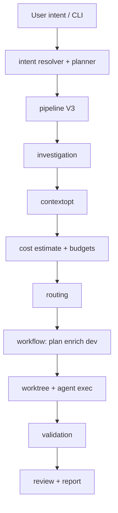

# Resumen de arquitectura

AgentFlow es una CLI Go (`application/cmd/agentflow`) con la mayor parte del comportamiento en `application/internal/` y contratos compartidos en `application/pkg/agentflow`. Esta división mantiene el binario fino mientras aísla parsing, planificación, investigación, coste y almacenamiento tras paquetes explícitos que puedes razonar solo con el layout del árbol.

## Pipeline de ejecución

La ruta de extremo a extremo empieza en la CLI, resuelve intención, ejecuta el pipeline V3 (investigación, optimización de contexto, coste y presupuestos, enrutamiento), luego etapas de workflow — plan, enrich, dev — en un worktree antes de validación, revisión opcional e informe.

## Módulos internos

| Paquete | Rol |
| --- | --- |
| `cli` | Comandos Cobra, docgen, contexto app |
| `config` | Carga YAML, valores por defecto, rutas |
| `intent` | NL `work`/`continue`, resolvedor híbrido, ejecutor |
| `workflow` | Máquina de estados, plan/dev/verify/review, worktrees |
| `worktree` | Ciclo de vida git worktree |
| `agent` / `agent/exec` | Contratos de subproceso |
| `source` / `source/notion` | Ingesta de specs |
| `contextopt` | Recoger/reducir/pack de contexto |
| `investigation` | grep/escaneo local |
| `cost` | Tokens, precios, presupuestos |
| `routing` | Clase de paso → agente/modelo |
| `mcp` | Herramientas MCP stdio (opcional) |
| `store/sqlite` | Runs, tareas, métricas |
| `report` | Informes de run |
| `tui` | UI rich/plain/json |
| `rag` | Índice de chunks (SQLite, no vectorial) |
| `bootstrap` | `init`, `doctor` |
| `redact` | Enmascarado de secretos en logs |
| `validation` | Ejecutor de comandos externos |

## Almacenamiento de estado

Runs y tareas persisten en **SQLite** en `state.path` (por defecto `.agentflow/state.sqlite`). Los artefactos de cada run van bajo `.agentflow/runs/<run-id>/`, manteniendo prompts, logs y salidas intermedias localizables sin releer la base.

## Puntos de extensión

Nuevos agentes solo con config; quality gates vía `validation.commands`; estrategias de enrutamiento bajo `routing.strategies`; herramientas MCP opcionales con `mcp.enabled: true`. Costuras intencionales: la mayoría de equipos extienden AgentFlow sin bifurcar el entrypoint Go.

## Relacionado

- [Configuración](/docs/es/configuration/config-file)
- [Fiabilidad: worktrees](/docs/es/reliability/worktree-isolation)
- [Resumen MCP](/docs/es/mcp/overview)
