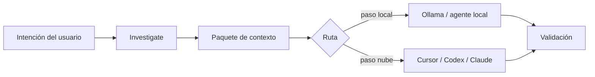

# Flujos local-first

## Problema

Enviar repositorios enteros a modelos en la nube es lento, costoso y riesgoso. La mayoría de preguntas de ingeniería se puede acotar con **herramientas locales**: búsqueda, recorrido de archivos, símbolos y empaquetado de contexto estructurado.

## Enfoque de AgentFlow

Antes de pasos de agente costosos, AgentFlow puede:

1. **`agentflow investigate <feature>`** — grep acotado, archivos candidatos, avisos de archivos grandes, tests relacionados
2. **`agentflow context <feature> --optimize`** — recopilar, puntuar y comprimir contexto en un paquete
3. **Enrutamiento** — preferir Ollama/perfiles locales para summarize, classify, `pre_review`, `context_selection` (véase `routing.strategies.cost_aware`)



## Ejemplo

```bash
agentflow investigate billing-v2 --task task-003
agentflow context billing-v2 --task task-003 --optimize
agentflow work "develop billing-v2" --prefer-local --estimate-only
```

## Compromisos

| Mejora | No resuelve |
| --- | --- |
| Latencia y coste en triage | Comprensión semántica de un gran modelo en la nube |
| Registros de investigación repetibles | Ranking de relevancia perfecto (puntuación heurística) |
| Pasos sin conexión posibles con Ollama | Cumplimiento air-gap sin su propia revisión |

## Configuración

```yaml
routing:
  default_strategy: cost_aware
  strategies:
    cost_aware:
      prefer_local_for: [summarize, classify, context_selection, pre_review]

mcp:
  investigation:
    large_file_bytes: 524288
    max_grep_output_bytes: 262144
```

Los límites de investigación aplican incluso con `mcp.enabled: false` — configuración compartida bajo `mcp.investigation`.

## Ver también

- [Investigación local](/docs/es/cost-performance/local-investigation)
- [Optimización de contexto](/docs/es/cost-performance/context-optimization)
- [Estimación de tokens](/docs/es/cost-performance/token-estimation)
