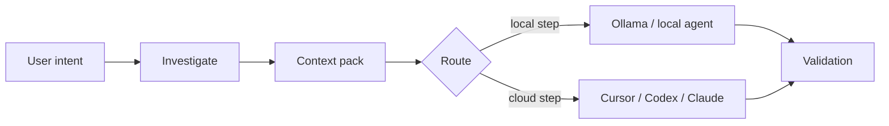

# Flujos local-first

## Problema

Empujar un repositorio entero por un modelo cloud es lento, caro y a menudo filtra más código del que la tarea requiere. Muchas preguntas de ingeniería se reducen al buscar en el árbol, listar archivos candidatos y aplicar empaquetado estructurado — trabajo que pertenece a tu máquina con herramientas ordinarias, no en un prompt remoto.

## Enfoque Asagiri

Asagiri trata **la investigación local y la reducción de contexto** como preludio de primera clase. Antes de los pasos caros, Asagiri puede acotar lo que sale del repo:

1. **`asa investigate <feature>`** — grep acotado, archivos candidatos, avisos de archivos grandes, tests relacionados
2. **`asa context <feature> --optimize`** — recoger, puntuar y comprimir contexto en un pack
3. **Enrutamiento** — preferir Ollama o perfiles locales para `summarize`, `classify`, `pre_review` y `context_selection` cuando `routing.strategies.cost_aware` está activo

El flujo es lineal en la práctica: la intención del usuario alimenta la investigación, la investigación un pack de contexto, el enrutamiento elige local o cloud, y ambos caminos convergen en validación.



## Ejemplo

La secuencia siguiente ejecuta investigación y optimización de contexto para una feature, luego previsualiza un `work` con preferencia local y estimate-only:

```bash
asa investigate billing-v2 --task task-003
asa context billing-v2 --task task-003 --optimize
asa work "develop billing-v2" --prefer-local --estimate-only
```

## Compromisos

| Mejora | No resuelve |
| --- | --- |
| Latencia y coste del triaje | Comprensión semántica igual a un modelo cloud grande |
| Logs de investigación reproducibles | Ranking de relevancia perfecto (puntuación heurística) |
| Pasos offline con Ollama | Cumplimiento air-gapped sin tu propia revisión |

## Configuración

El fragmento activa enrutamiento cost_aware y fija límites compartidos de investigación. Aplican aunque `mcp.enabled` sea false: viven bajo `mcp.investigation` como config compartida para herramientas locales.

```yaml
routing:
  default_strategy: cost_aware
  strategies:
    cost_aware:
      prefer_local_for: [summarize, classify, context_selection, pre_review]

mcp:
  investigation:
    large_file_bytes: 524288
    max_grep_output_bytes: 262144
```

## Relacionado

- [Investigación local](/docs/es/cost-performance/local-investigation)
- [Optimización de contexto](/docs/es/cost-performance/context-optimization)
- [Estimación de tokens](/docs/es/cost-performance/token-estimation)
