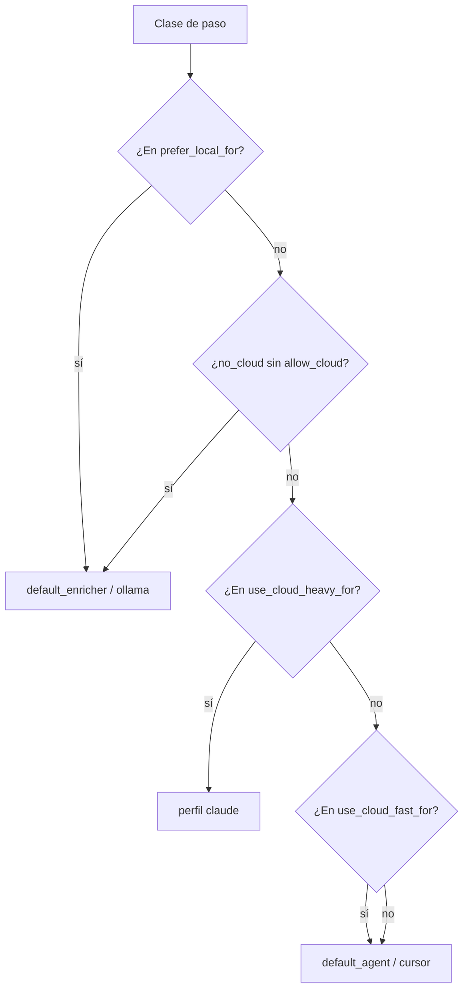

# Enrutamiento

`application/internal/routing/router.go` selecciona agente/modelo desde la configuración usando cadenas de clase de paso (p. ej. `summarize`, `implementation`, `pre_review`).

## Configuración

```yaml
routing:
  default_strategy: cost_aware
  strategies:
    cost_aware:
      prefer_local_for: [summarize, classify, context_selection, pre_review, log_analysis]
      use_cloud_fast_for: [implementation_medium, review_medium, planning_complex]
      use_cloud_heavy_for: [architecture_critical, security_sensitive, large_refactor]
      local_failures_before_cloud: 1
      cloud_fast_failures_before_heavy: 1
```

## Flujo de decisión



## Anulaciones CLI

| Bandera | Efecto |
| --- | --- |
| `--prefer-local` | fuerza la ruta local cuando la estrategia coincide |
| `--no-cloud` | bloquea la nube salvo con `--allow-cloud` |
| `--allow-cloud` | permiso explícito para la nube |

<Callout type="experimental">
La calidad del enrutamiento a la nube depende por completo de sus entradas `models` y `agents` — AgentFlow no llama a APIs de proveedor para elegir modelos automáticamente.
</Callout>

## Ver también

- [Conceptos conscientes del coste](/docs/es/concepts/cost-aware-workflows)
- [Modelos en el archivo de configuración](/docs/es/configuration/config-file#models)
