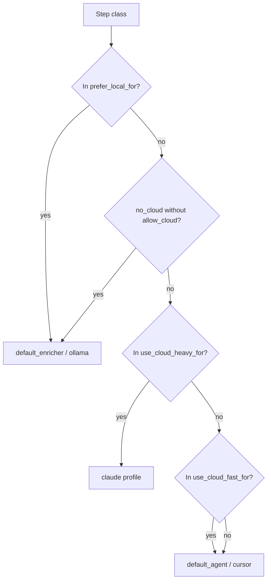

# Enrutado

`application/internal/routing/router.go` asigna a cada paso un agente y un modelo mediante cadenas de **clase de paso** como `summarize`, `implementation` o `pre_review`. El router consulta `routing` en `config.yaml`; no llama a los proveedores para «descubrir» modelos — sus tablas `models` y `agents` son la fuente de verdad.

## Configuración

Las estrategias agrupan preferencias : qué clases permanecen en pila local, cuáles justifican un perfil cloud rápido, cuáles uno más pesado, y cuántos fallos disparan una vía alternativa.

```yaml
routing:
  default_strategy: cost_aware
  strategies:
    cost_aware:
      prefer_local_for: [summarize, classify, context_selection, pre_review, log_analysis]
      use_cloud_fast_for: [implementation_medium, review_medium, planning_complex]
      use_cloud_heavy_for: [architecture_critical, security_sensitive, large_refactor]
      local_failures_before_cloud: 1
      cloud_fast_failures_before_heavy: 1
```

## Flujo de decisión

El diagrama refleja el orden en el código: preferencia local primero, bloqueos cloud después, buckets cloud pesado versus rápido, con rechazos razonables cuando una clase encaja laxamente.



## Overrides CLI

Estos flags alteran el mismo grafo sin editar YAML: forzar lo local donde la estrategia lo permite, impedir cloud salvo si empareja los flags de permiso explícitamente.

| Flag | Efecto |
| --- | --- |
| `--prefer-local` | Fuerza ruta local si la estrategia coincide |
| `--no-cloud` | Bloquea cloud salvo junto con `--allow-cloud` |
| `--allow-cloud` | Permiso cloud explícito |

<Callout type="experimental">
La calidad del enrutado cloud depende enteramente de sus entradas `models` y `agents` — Asagiri no llama APIs de proveedor para elegir modelos automáticamente.
</Callout>

## Relacionado

- [Conceptos sensibles al coste](/docs/es/concepts/cost-aware-workflows)
- [Modelos en el archivo de configuración](/docs/es/configuration/config-file#models)
