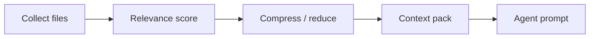

# Optimización de contexto

La implementación reside en `application/internal/contextopt` : un recolector agrupa ficheros candidatos, un puntuador de relevancia los ordena, un reductor o compresor elimina material de bajo valor y un empacador emite el blob que los agentes realmente ven. La intención es enviar contexto **más pequeño y mejor orientado** a APIs de pago manteniendo reglas de reducción inspeccionables desde la CLI.

## Pipeline



## CLI

```bash
agentflow context billing-v2 --task task-003
agentflow context billing-v2 --task task-003 --optimize
agentflow work "develop billing-v2" --show-context-plan
```

`work` ejecuta la optimización en el pipeline V3 salvo si se establece `--no-context-reduction`.

## Configuración

Los límites de investigación que acotan la salida de grep y archivos grandes se comparten con la investigación local : viven bajo `mcp.investigation` en la configuración y **aplican aun cuando el servidor MCP está desactivado**, porque gobiernan la herramienta local que alimenta al recolector.

## Compensaciones

| Beneficio | Límite |
| --- | --- |
| Prompts más pequeños | Puede descartar archivos relevantes si las heurísticas fallan |
| Llamadas cloud más rápidas | No sustituye leer rutas críticas a mano |

<Callout type="experimental">
Las heurísticas de compresión automática evolucionan — compare la salida de `--show-context-plan` al depurar contexto perdido.
</Callout>

## Relacionado

- [Local-first](/docs/es/concepts/local-first)
- [CLI: context](/docs/es/cli/generated/context)
