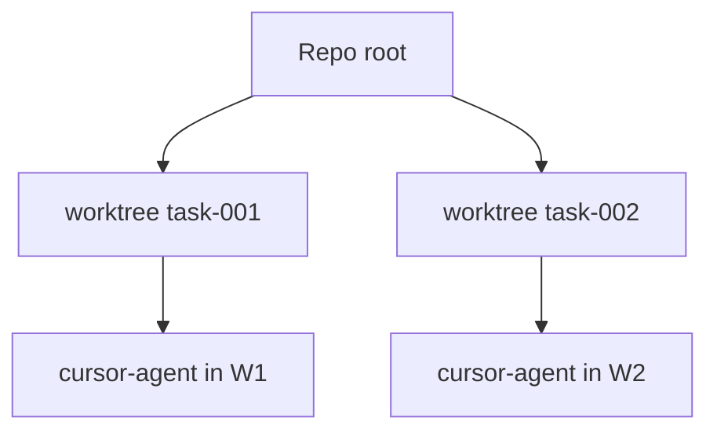

# Aislamiento por worktrees

Implementación **`application/internal/worktree`** que entra cuando **`workflow.Service.DevFeature`** necesita zona aislada para **`dev`**.

## Comportamiento

La aislamiento es predecible:

1. Para cada tarea Asagiri crea worktree debajo `worktrees.base_path`
2. Rama con `worktrees.branch_prefix` + id feature/tarea
3. Subprocesos agente ejecutan con `WorkingDir` en ese worktree
4. `asa clean` borra conforme `cleanup_policy`

```yaml
worktrees:
  base_path: .asagiri/worktrees
  branch_prefix: asa
  cleanup_policy: keep_failed   # keep_failed | always | ...
```

## Diagrama

Las tareas concurrentes se bifurcan desde raíz oficial sin workspace sucio accidental compartido:



## Dry-run

`--dry-run` omite/simula crear worktrees — integración puede depender cuando CI debe evitar ramas fugaces innecesarias.

## Policies

Combina **`policies.max_files_changed_per_task`** con revisión manual previa fusión ; limita alcance físico pero no vigilancia estratégica.

## Relacionado

- [Recuperación ante fallos](/docs/es/workflows/failure-recovery)
- [CLI: clean](/docs/es/cli/generated/clean)
- [CLI: dev](/docs/es/cli/generated/dev)
