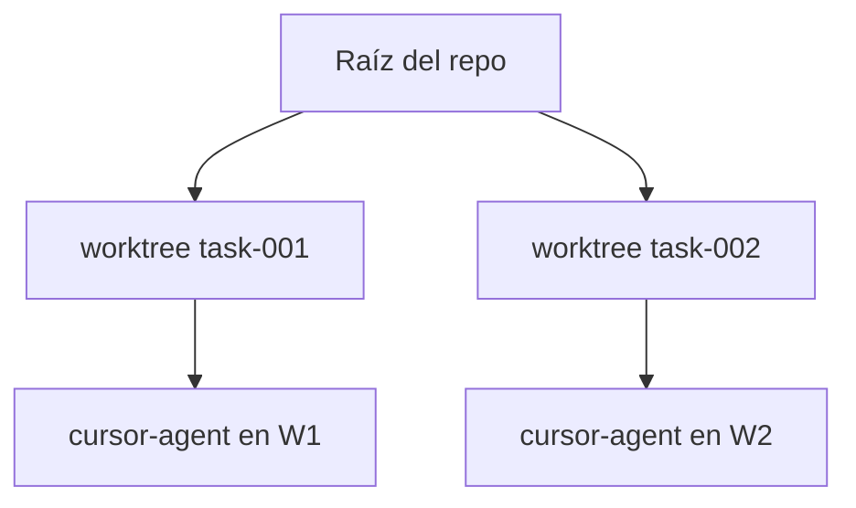

# Aislamiento de worktrees

Implementación: `application/internal/worktree` — creado durante `dev` en `workflow.Service.DevFeature`.

## Comportamiento

1. Por cada tarea, AgentFlow crea un worktree bajo `worktrees.base_path`
2. El nombre de rama usa `worktrees.branch_prefix` + id de feature/tarea
3. Los subprocess del agente se ejecutan con `WorkingDir` en la ruta del worktree
4. `agentflow clean` elimina worktrees según `cleanup_policy`

```yaml
worktrees:
  base_path: .agentflow/worktrees
  branch_prefix: agentflow
  cleanup_policy: keep_failed   # keep_failed | always | ...
```

## Diagrama



## Dry-run

Con `--dry-run`, la creación del worktree se omite o simula — las pruebas de integración dependen de ello para ejecuciones seguras en CI.

## Políticas

`policies.max_files_changed_per_task` limita el radio de explosión; combínelo con revisión humana antes del merge.

## Ver también

- [Recuperación ante fallos](/docs/es/workflows/failure-recovery)
- [CLI: clean](/docs/cli/generated/clean)
- [CLI: dev](/docs/cli/generated/dev)
