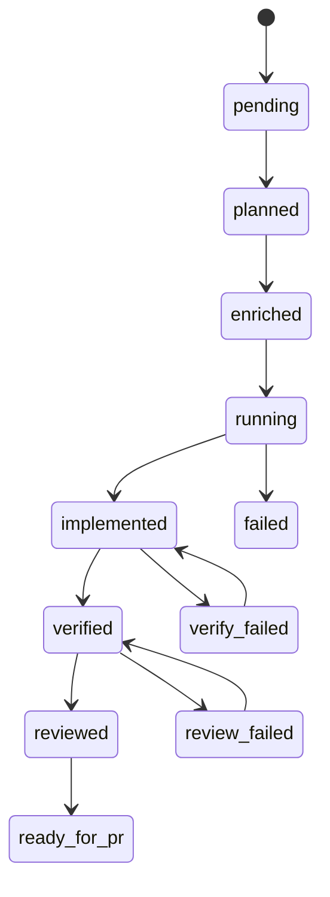

# Recuperación ante fallos

Asagiri persiste estados claros antes deducirlos archivo suelto respetarlos usando overrides documentados permite desatascar sin dañar historia.

## Máquina estados modelada

Declarada `workflow/state_machine.go`:



Pasos ilegales regresar error salvo comandos especialmente permitido `--force`.

## Recetas frecuentes

### Verify roto arreglé código

```bash
# fix local worktree después:
asa verify billing-v2 --force
```

### Review fracasado

```bash
asa review billing-v2 --agent codex --force
```

### Run interrumpe mid pipeline

```bash
asa status
asa resume <run-id>          # muestra siguiente plan|dev|review...
asa continue "resume billing-v2"
```

<Callout type="experimental">
`asa resume <run-id> --execute` encadena los steps restantes (agentes reales sin `--dry-run` global). Sin `--execute`, ejecute el step impreso o `continue`. Ver [resume CLI](/docs/es/cli/resume).
</Callout>

### Worktrees viejas

```bash
asa clean
```

Politica retention `cleanup_policy` determina preservación fallidas.

## Post mortems

```bash
asa report <run-id>
asa investigate billing-v2
```

## Relacionado

- [Aislamiento worktree](/docs/es/reliability/worktree-isolation)
- [CLI resume](/docs/es/cli/generated/resume)
- [CLI continue](/docs/es/cli/generated/continue)
