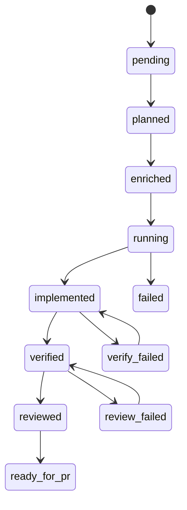

# Recuperación ante fallos

## Máquina de estados

Las tareas pasan por estados explícitos aplicados en `workflow/state_machine.go`:



Las transiciones inválidas devuelven error salvo que `--force` esté permitido en el comando.

## Recuperaciones habituales

### Verify fallido

```bash
# corrija el código en el worktree, luego:
agentflow verify billing-v2 --force
```

### Revisión fallida

```bash
agentflow review billing-v2 --agent codex --force
```

### Ejecución interrumpida

```bash
agentflow status
agentflow resume <run-id>          # imprime el siguiente paso: plan|enrich|dev|verify|review
agentflow continue "resume billing-v2"   # continuación por intención
```

<Callout type="experimental">
`agentflow resume <run-id> --execute` encadena pasos solo con **`--dry-run` global**. Fuera de dry-run, `resume` no invoca agentes automáticamente — ejecute el paso impreso manualmente o use `continue`.
</Callout>

### Limpiar worktrees obsoletos

```bash
agentflow clean
```

Elimina worktrees según `worktrees.cleanup_policy` (`keep_failed` conserva árboles de tareas fallidas).

## Informes para post-mortems

```bash
agentflow report <run-id>
agentflow investigate billing-v2
```

## Ver también

- [Aislamiento de worktrees](/docs/es/reliability/worktree-isolation)
- [CLI: resume](/docs/cli/generated/resume)
- [CLI: continue](/docs/cli/generated/continue)
