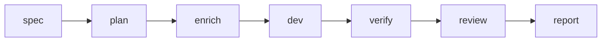

# Kiro → Cursor → Verify

Flujo de entrega desde specs Kiro hasta implementación en Cursor con barreras AgentFlow (`spec-doc` §11.2).

## Cuándo usarlo

Mantiene requisitos y tareas en **Kiro** (`.kiro/specs/<feature>/`) pero quiere **Cursor** (o `cursor-agent`) para implementar, con pasos obligatorios de verify/review.

## Pipeline



## Comandos

Sustituya `billing-v2` por el id de su feature:

```bash
agentflow spec billing-v2 --agent kiro
agentflow plan billing-v2
agentflow enrich billing-v2 --agent ollama
agentflow dev billing-v2 --agent cursor
agentflow verify billing-v2
agentflow review billing-v2 --agent codex
agentflow report <run-id>
```

Use `--dry-run` en cualquier paso durante el ensayo:

```bash
agentflow dev billing-v2 --agent cursor --dry-run
```

## Valores por defecto de configuración

Desde `.agentflow/config.yaml.example`:

```yaml
work:
  default_agent: cursor
  default_reviewer: codex
  default_enricher: ollama
  auto_verify: true
  auto_review: false
```

Configure `work.auto_review: true` solo si desea revisión tras cada verify exitoso.

## Atajo por intención

```bash
agentflow work "develop billing-v2" --stop-after verify
```

La resolución de intención elige la feature; el pipeline V3 aplica presupuestos y optimización de contexto.

## Modos de fallo

| Síntoma | Corrección |
| --- | --- |
| `kiro` no está en el PATH | Defina `agents.kiro.command` o instale la CLI de Kiro |
| Falla verify | Corrija tests localmente; use `agentflow verify billing-v2 --force` solo si la máquina de estados lo permite |
| Git sucio bloqueado | Commit/stash o ajuste `policies.require_clean_git` |

## Ver también

- [CLI: spec](/docs/cli/generated/spec)
- [CLI: dev](/docs/cli/generated/dev)
- [Descripción general de arquitectura](/docs/es/architecture/overview)
