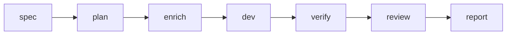

# Kiro → Cursor → Verify

Este recorrido enlaza **`spec-doc` §11.2** con las compuertas Asagiri — la escritura sigue **Kiro** (`.kiro/specs/<feature>/`), donde **Cursor** (o **`cursor-agent`**) mejor brilla ejecuta desarrollo CLI obliga **`verify`** / **`review`** deterministas así automatización jamás cambia inadvertidamente.

## Cuándo aplicarlo

Specs y tasks en **Kiro** pero implementación con **Cursor** exigiendo revisión después verificación automatizada obligatorias.

## Pipeline

Ejemplo conceptual aún report downstream consume IDs persistidas.



## Comandos sustituye feature id

```bash
asa spec billing-v2 --agent kiro
asa plan billing-v2
asa enrich billing-v2 --agent ollama
asa dev billing-v2 --agent cursor
asa verify billing-v2
asa review billing-v2 --agent codex
asa report <run-id>
```

Ensayo usando `--dry-run` :

```bash
asa dev billing-v2 --agent cursor --dry-run
```

## Valores ejemplo config

Snippet `.asagiri/config.yaml.example` :

```yaml
work:
  default_agent: cursor
  default_reviewer: codex
  default_enricher: ollama
  auto_verify: true
  auto_review: false
```

Toggle `auto_review` true sólo cuando desee revisiones cada verify exitoso.

## Atajo intentación

```bash
asa work "develop billing-v2" --stop-after verify
```

Resolver intenciones elige función pipeline versión tres aplica presupuesto y reducción contextual.

## Diagnósticos

| Hallazgo | Acción correctiva |
| --- | --- |
| `kiro` ausente PATH | Ajuste comando agente instalación herramienta |
| Verify fallidos | Correcciones código entonces fuerza comando cuando máquina estados permite |
| git sucio veto | stash commit política laxar |

## Relacionado

- [CLI spec](/docs/es/cli/generated/spec)
- [CLI dev](/docs/es/cli/generated/dev)
- [Arquitectura general](/docs/es/architecture/overview)
