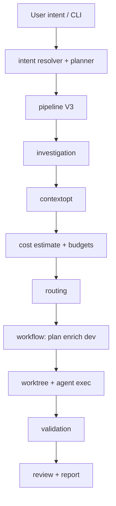

# Vue d'ensemble de l'architecture

AgentFlow est une CLI Go (`application/cmd/agentflow`) dont la majeure partie du comportement vit dans `application/internal/` et les contrats partagés dans `application/pkg/agentflow`. Cette séparation garde le binaire fin tout en isolant parsing, planification, investigation, coût et stockage derrière des packages explicites que vous pouvez raisonner depuis la seule arborescence.

## Pipeline d'exécution

Le chemin de bout en bout part de la CLI, résout l'intention, exécute le pipeline V3 (investigation, optimisation du contexte, coût et budgets, routage), puis les étapes workflow — plan, enrich, dev — dans un worktree avant validation, revue optionnelle et rapport.

## Modules internes

| Package | Rôle |
| --- | --- |
| `cli` | Commandes Cobra, docgen, contexte app |
| `config` | Chargement YAML, défauts, résolution de chemins |
| `intent` | NL `work`/`continue`, résolveur hybride, exécuteur |
| `workflow` | Machine à états, plan/dev/verify/review, worktrees |
| `worktree` | Cycle de vie git worktree |
| `agent` / `agent/exec` | Contrats subprocess |
| `source` / `source/notion` | Ingestion de specs |
| `contextopt` | Collecte/réduction/pack de contexte |
| `investigation` | grep/scan local |
| `cost` | Jetons, tarification, budgets |
| `routing` | Classe d'étape → agent/modèle |
| `mcp` | Outils MCP stdio (optionnel) |
| `store/sqlite` | Runs, tâches, métriques |
| `report` | Rapports de run |
| `tui` | UI rich/plain/json |
| `rag` | Index de chunks (SQLite, non vectoriel) |
| `bootstrap` | `init`, `doctor` |
| `redact` | Masquage de secrets dans les logs |
| `validation` | Exécuteur de commandes externes |

## Stockage d'état

Runs et tâches persistent dans **SQLite** à `state.path` (défaut `.agentflow/state.sqlite`). Les artefacts de chaque run vont sous `.agentflow/runs/<run-id>/`, ce qui garde prompts, logs et sorties intermédiaires adressables sans relire la base.

## Points d'extension

Nouveaux agents via la config seule ; nouvelles portes qualité via `validation.commands` ; stratégies de routage sous `routing.strategies` ; outils MCP optionnels quand `mcp.enabled: true`. Ce sont des coutures intentionnelles : la plupart des équipes étendent AgentFlow sans forker le point d'entrée Go.

## Voir aussi

- [Configuration](/docs/fr/configuration/config-file)
- [Fiabilité : worktrees](/docs/fr/reliability/worktree-isolation)
- [Vue d'ensemble MCP](/docs/fr/mcp/overview)
