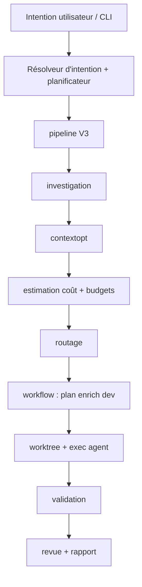

# Vue d'ensemble de l'architecture

AgentFlow est une CLI Go (`application/cmd/agentflow`) avec logique métier dans `application/internal/` et types partagés dans `application/pkg/agentflow`.

## Pipeline d'exécution

## Modules internes

| Paquet | Rôle |
| --- | --- |
| `cli` | Commandes Cobra, docgen, contexte applicatif |
| `config` | Chargement YAML, défauts, résolution des chemins |
| `intent` | NL `work`/`continue`, résolveur hybride, exécuteur |
| `workflow` | Machine d'état, plan/dev/verify/revue, worktrees |
| `worktree` | Cycle de vie des git worktrees |
| `agent` / `agent/exec` | Contrats subprocess |
| `source` / `source/notion` | Ingestion des specs |
| `contextopt` | Collecte/réduction/paquetage du contexte |
| `investigation` | Grep/scan local |
| `cost` | Jetons, tarification, budgets |
| `routing` | Classe d'étape → agent/modèle |
| `mcp` | Outils MCP stdio (optionnel) |
| `store/sqlite` | Exécutions, tâches, métriques |
| `report` | Rapports d'exécution |
| `tui` | UI rich/plain/json |
| `rag` | Index de morceaux (SQLite, non vectoriel) |
| `bootstrap` | `init`, `doctor` |
| `redact` | Masquage des secrets dans les journaux |
| `validation` | Lanceur de commandes externes |

## Stockage d'état

- **SQLite** à `state.path` (défaut `.agentflow/state.sqlite`)
- Artefacts d'exécution : `.agentflow/runs/<run-id>/`

## Points d'extension

- Nouveaux agents : config uniquement
- Nouvelles commandes de validation : `validation.commands`
- Stratégies de routage personnalisées : `routing.strategies`
- Outils MCP lorsque `mcp.enabled: true`

## Voir aussi

- [Configuration](/docs/fr/configuration/config-file)
- [Fiabilité : worktrees](/docs/fr/reliability/worktree-isolation)
- [Vue d'ensemble MCP](/docs/fr/mcp/overview)
