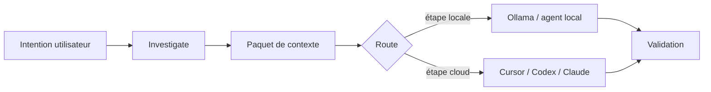

# Workflows local-first

## Problème

Envoyer des dépôts entiers vers des modèles cloud est lent, coûteux et risqué. La plupart des questions d'ingénierie se réduisent avec des **outils locaux** : recherche, parcours de fichiers, consultation de symboles et paquetage de contexte structuré.

## Approche AgentFlow

Avant les étapes agent coûteuses, AgentFlow peut :

1. **`agentflow investigate <feature>`** — grep borné, fichiers candidats, alertes gros fichiers, tests liés
2. **`agentflow context <feature> --optimize`** — collecte, score, compression en paquet de contexte
3. **Routage** — préférer Ollama/profils locaux pour summarize, classify, `pre_review`, `context_selection` (voir `routing.strategies.cost_aware`)



## Exemple

```bash
agentflow investigate billing-v2 --task task-003
agentflow context billing-v2 --task task-003 --optimize
agentflow work "develop billing-v2" --prefer-local --estimate-only
```

## Compromis

| Améliore | Ne résout pas |
| --- | --- |
| Latence et coût du triage | Compréhension sémantique équivalente à un gros modèle cloud |
| Journaux d'investigation reproductibles | Pertinence parfaite du classement (score heuristique) |
| Étapes hors ligne possibles avec Ollama | Conformité air-gap sans votre propre revue |

## Configuration

```yaml
routing:
  default_strategy: cost_aware
  strategies:
    cost_aware:
      prefer_local_for: [summarize, classify, context_selection, pre_review]

mcp:
  investigation:
    large_file_bytes: 524288
    max_grep_output_bytes: 262144
```

Les limites d'investigation s'appliquent même si `mcp.enabled` est false — configuration partagée sous `mcp.investigation`.

## Voir aussi

- [Investigation locale](/docs/fr/cost-performance/local-investigation)
- [Optimisation du contexte](/docs/fr/cost-performance/context-optimization)
- [Estimation des jetons](/docs/fr/cost-performance/token-estimation)
