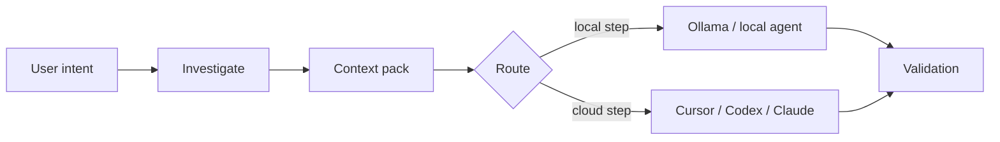

# Workflows local-first

## Problème

Envoyer tout un dépôt dans un modèle cloud est lent, coûteux, et fait souvent fuiter plus de code que la tâche ne l'exige. Beaucoup de questions d'ingénierie se réduisent une fois que vous avez cherché dans l'arbre, listé les fichiers candidats et appliqué un empilement structuré — travail qui appartient à votre machine avec des outils ordinaires, pas dans un prompt distant.

## Approche Asagiri

Asagiri traite **l'investigation locale et la réduction de contexte** comme prélude de premier ordre. Avant les étapes coûteuses, Asagiri peut restreindre ce qui quitte le dépôt :

1. **`asa investigate <feature>`** — grep borné, fichiers candidats, alertes gros fichiers, tests liés
2. **`asa context <feature> --optimize`** — collecter, scorer, compresser le contexte en un pack
3. **Routage** — préférer Ollama ou profils locaux pour `summarize`, `classify`, `pre_review` et `context_selection` quand `routing.strategies.cost_aware` est actif

Le flux est linéaire en pratique : l'intention utilisateur alimente l'investigation, l'investigation un pack de contexte, le routage choisit local ou cloud, et les deux chemins convergent vers la validation.



## Exemple

La séquence ci-dessous lance investigation et optimisation de contexte pour une feature, puis prévisualise un `work` avec préférence locale et estimate-only :

```bash
asa investigate billing-v2 --task task-003
asa context billing-v2 --task task-003 --optimize
asa work "develop billing-v2" --prefer-local --estimate-only
```

## Compromis

| Améliore | Ne résout pas |
| --- | --- |
| Latence et coût du triage | Compréhension sémantique égale à un gros modèle cloud |
| Journaux d'investigation reproductibles | Classement de pertinence parfait (score heuristique) |
| Étapes offline avec Ollama | Conformité air-gapped sans votre propre relecture |

## Configuration

L'extrait ci-dessous active le routage cost_aware et fixe des limites d'investigation partagées. Ces limites s'appliquent même si `mcp.enabled` est false : elles vivent sous `mcp.investigation` comme config partagée pour les outils locaux.

```yaml
routing:
  default_strategy: cost_aware
  strategies:
    cost_aware:
      prefer_local_for: [summarize, classify, context_selection, pre_review]

mcp:
  investigation:
    large_file_bytes: 524288
    max_grep_output_bytes: 262144
```

## Voir aussi

- [Investigation locale](/docs/fr/cost-performance/local-investigation)
- [Optimisation du contexte](/docs/fr/cost-performance/context-optimization)
- [Estimation des jetons](/docs/fr/cost-performance/token-estimation)
