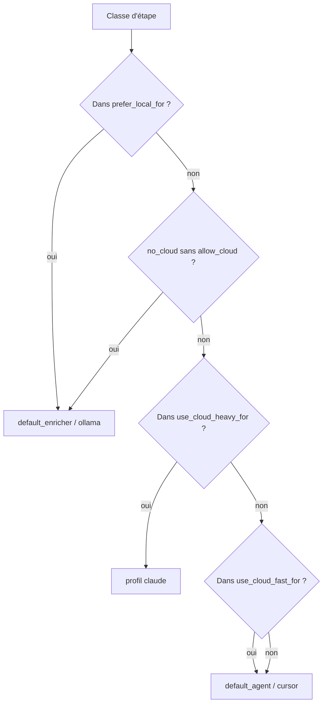

# Routage

`application/internal/routing/router.go` sélectionne agent/modèle depuis la config à partir de chaînes de classe d'étape (par ex. `summarize`, `implementation`, `pre_review`).

## Configuration

```yaml
routing:
  default_strategy: cost_aware
  strategies:
    cost_aware:
      prefer_local_for: [summarize, classify, context_selection, pre_review, log_analysis]
      use_cloud_fast_for: [implementation_medium, review_medium, planning_complex]
      use_cloud_heavy_for: [architecture_critical, security_sensitive, large_refactor]
      local_failures_before_cloud: 1
      cloud_fast_failures_before_heavy: 1
```

## Flux de décision



## Surcharges CLI

| Drapeau | Effet |
| --- | --- |
| `--prefer-local` | Force le chemin local lorsque la stratégie correspond |
| `--no-cloud` | Bloque le cloud sauf avec `--allow-cloud` |
| `--allow-cloud` | Autorisation cloud explicite |

<Callout type="experimental">
La qualité du routage cloud dépend entièrement de vos entrées `models` et `agents` — AgentFlow n'appelle pas d'API fournisseur pour choisir les modèles automatiquement.
</Callout>

## Voir aussi

- [Concepts conscients des coûts](/docs/fr/concepts/cost-aware-workflows)
- [Modèles dans le fichier de configuration](/docs/fr/configuration/config-file#models)
