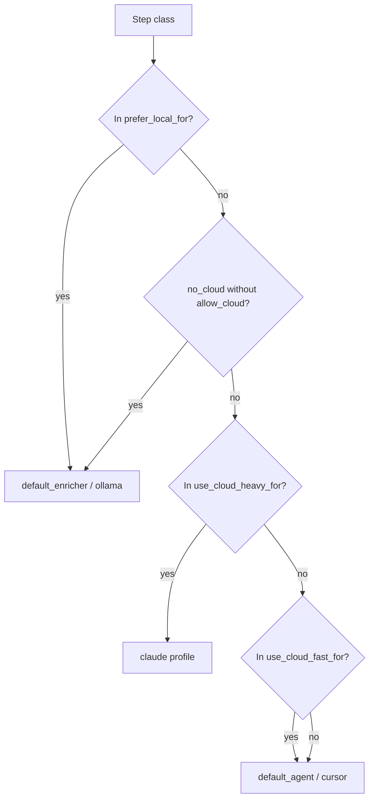

# Routage

`application/internal/routing/router.go` associe chaque étape à un agent et à un modèle à l’aide de chaînes de **classe d’étape** telles que `summarize`, `implementation` ou `pre_review`. Le routeur lit `routing` dans `config.yaml`; il ne contacte pas les fournisseurs pour « découvrir » des modèles — vos entrées `models` et `agents` font autorité.

## Configuration

Les stratégies regroupent des préférences : quelles classes restent sur la pile locale, lesquelles justifient un profil cloud rapide, lesquelles méritent un profil plus lourd, et combien d’échecs déclenchent un chemin de repli.

```yaml
routing:
  default_strategy: cost_aware
  strategies:
    cost_aware:
      prefer_local_for: [summarize, classify, context_selection, pre_review, log_analysis]
      use_cloud_fast_for: [implementation_medium, review_medium, planning_complex]
      use_cloud_heavy_for: [architecture_critical, security_sensitive, large_refactor]
      local_failures_before_cloud: 1
      cloud_fast_failures_before_heavy: 1
```

## Graphe de décision

Le schéma reflète l’ordre de décision dans le code : préférence locale d’abord, puis règles de blocage cloud, puis compartiments cloud lourd versus rapide, avec des replis raisonnables lorsqu’une classe ne correspond pas étroitement.



## Overrides CLI

Ces bascules modulent le même graphe de décision sans toucher au YAML : forcer le chemin local quand la stratégie le permet, retirer le cloud sauf si vous associez explicitement les drapeaux d’autorisation.

| Option | Effet |
| --- | --- |
| `--prefer-local` | Force le chemin local quand la stratégie correspond |
| `--no-cloud` | Bloque le cloud sauf avec `--allow-cloud` |
| `--allow-cloud` | Autorisation cloud explicite |

<Callout type="experimental">
La qualité du routage cloud dépend entièrement de vos entrées `models` et `agents` — Asagiri n’appelle pas les API fournisseur pour choisir les modèles automatiquement.
</Callout>

## Voir aussi

- [Concepts soucieux des coûts](/docs/fr/concepts/cost-aware-workflows)
- [Modèles dans le fichier de configuration](/docs/fr/configuration/config-file#models)
