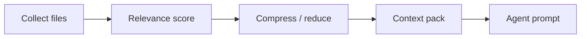

# Optimisation du contexte

L’implémentation vit dans `application/internal/contextopt` : un collecteur rassemble des fichiers candidats, un scoreur de pertinence les classe, un réducteur ou compresseur taille ce qui rapporte peu, et un empaquetage produit le bloc que les agents voient réellement. L’objectif est d’envoyer un contexte **plus petit et mieux ciblé** aux API payantes tout en gardant des règles de réduction inspectables depuis la CLI.

## Pipeline



## CLI

```bash
agentflow context billing-v2 --task task-003
agentflow context billing-v2 --task task-003 --optimize
agentflow work "develop billing-v2" --show-context-plan
```

`work` applique l’optimisation dans le pipeline V3 sauf si `--no-context-reduction` est passé.

## Configuration

Les plafonds d’investigation qui bornent grep et fichiers volumineux sont partagés avec l’investigation locale : ils vivent sous `mcp.investigation` dans la config et **s’appliquent même lorsque le serveur MCP est désactivé**, car ils gouvernent l’outillage local qui alimente le collecteur.

## Arbitrages

| Bénéfice | Limite |
| --- | --- |
| Prompts plus petits | Peut perdre des fichiers pertinents si les heuristiques ratent |
| Appels cloud plus rapides | Ne remplace pas la lecture manuelle des chemins critiques |

<Callout type="experimental">
Les heuristiques de compression évoluent — comparez la sortie de `--show-context-plan` si un contexte manquant vous intrigue.
</Callout>

## Voir aussi

- [Local-first](/docs/fr/concepts/local-first)
- [CLI : context](/docs/fr/cli/generated/context)
