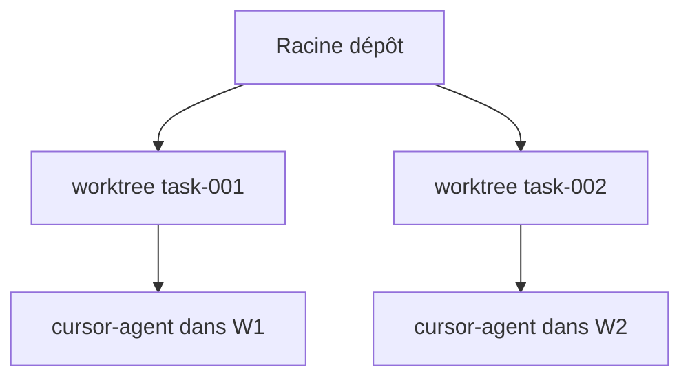

# Isolation des worktrees

Implémentation : `application/internal/worktree` — créé pendant `dev` dans `workflow.Service.DevFeature`.

## Comportement

1. Pour chaque tâche, AgentFlow crée un worktree sous `worktrees.base_path`
2. Le nom de branche utilise `worktrees.branch_prefix` + identifiant feature/tâche
3. Les subprocess agent s'exécutent avec `WorkingDir` pointant vers le worktree
4. `agentflow clean` retire les worktrees selon `cleanup_policy`

```yaml
worktrees:
  base_path: .agentflow/worktrees
  branch_prefix: agentflow
  cleanup_policy: keep_failed   # keep_failed | always | ...
```

## Schéma



## Dry-run

Avec `--dry-run`, la création de worktree est ignorée ou simulée — les tests d'intégration s'appuient là-dessus pour des exécutions sans risque en CI.

## Politiques

`policies.max_files_changed_per_task` limite le rayon d'explosion ; combinez avec revue humaine avant fusion.

## Voir aussi

- [Récupération après échec](/docs/fr/workflows/failure-recovery)
- [CLI : clean](/docs/cli/generated/clean)
- [CLI : dev](/docs/cli/generated/dev)
