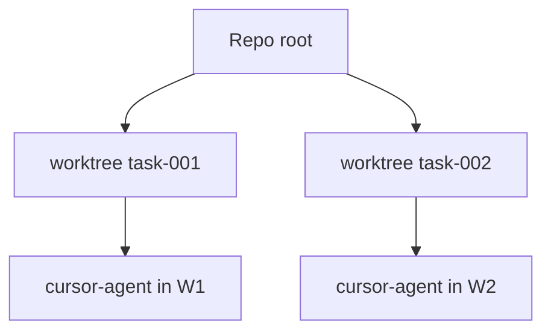

# Isolation par worktree

La logique se trouve dans **`application/internal/worktree`**, activée lorsque **`workflow.Service.DevFeature`** provisionne une zone isolée pour **`dev`**.

## Comportement

L’isolation reste prévisible :

1. Pour chaque tâche Asagiri crée un worktree sous `worktrees.base_path`
2. Nom de branche `worktrees.branch_prefix` + id fonctionnalité/tâche
3. Les sous-processus agents s’exécutent avec `WorkingDir` sur le chemin du worktree
4. `asa clean` retire les worktrees selon `cleanup_policy`

```yaml
worktrees:
  base_path: .asagiri/worktrees
  branch_prefix: asa
  cleanup_policy: keep_failed   # keep_failed | always | ...
```

## Schéma

Des tâches concurrentes peuvent donc rayonner depuis le checkout canonique sans se partager un working tree « sale » :



## Dry-run

`--dry-run` saute ou simule la création du worktree — les tests d’intégration s’appuient dessus lorsque CI ne doit pas matérialiser de branches fugaces.

## Politiques

Coupler **`policies.max_files_changed_per_task`** avec examen humain avant fusion ; cette molette borne le rayon d’impact, pas la vigilance cognitive.

## Voir aussi

- [Récupération après échec](/docs/fr/workflows/failure-recovery)
- [CLI : clean](/docs/fr/cli/generated/clean)
- [CLI : dev](/docs/fr/cli/generated/dev)
