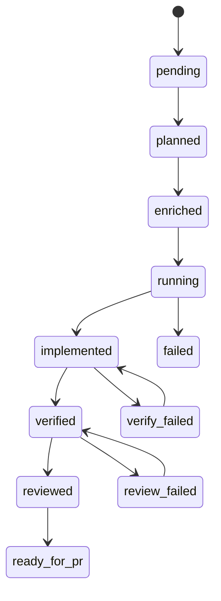

# Récupération après échec

## Machine d'état

Les tâches passent par des statuts explicites appliqués dans `workflow/state_machine.go` :



Les transitions invalides renvoient une erreur sauf si `--force` est autorisé sur la commande.

## Récupérations courantes

### Échec de verify

```bash
# corriger le code dans le worktree, puis :
agentflow verify billing-v2 --force
```

### Échec de revue

```bash
agentflow review billing-v2 --agent codex --force
```

### Exécution interrompue

```bash
agentflow status
agentflow resume <run-id>          # affiche l'étape suivante : plan|enrich|dev|verify|review
agentflow continue "resume billing-v2"   # continuation par intention
```

<Callout type="experimental">
`agentflow resume <run-id> --execute` enchaîne les étapes uniquement avec **`--dry-run` global**. Hors dry-run, `resume` ne réinvoque pas les agents — exécutez l'étape affichée manuellement ou utilisez `continue`.
</Callout>

### Nettoyer les worktrees obsolètes

```bash
agentflow clean
```

Retire les worktrees selon `worktrees.cleanup_policy` (`keep_failed` conserve les arbres des tâches en échec).

## Rapports pour post-mortems

```bash
agentflow report <run-id>
agentflow investigate billing-v2
```

## Voir aussi

- [Isolation des worktrees](/docs/fr/reliability/worktree-isolation)
- [CLI : resume](/docs/cli/generated/resume)
- [CLI : continue](/docs/cli/generated/continue)
