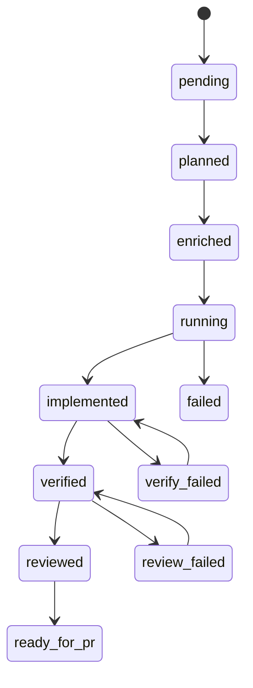

# Récupération après échec

Asagiri matérialise des états de tâches explicites plutôt qu’imaginer progression à partir fichiers perdus récupération propre exige suivre ces transitions ou utiliser surcharges orchestrateur (`--force`, helpers resume) où supporté.

## Machine à états

Statuts forcés depuis `workflow/state_machine.go`:



Transitions hors graphe erreur sauf commandes précises autorisées `--force`.

## Recettes fréquentes

### Échec verify

```bash
# corriger code dans worktree ensuite:
asa verify billing-v2 --force
```

### Échec review

```bash
asa review billing-v2 --agent codex --force
```

### Exécution interrompue

```bash
asa status
asa resume <run-id>          # affiche prochain étape possible plan|enrich|dev...
asa continue "resume billing-v2"   # continuation intentionnelle
```

<Callout type="experimental">
`asa resume <run-id> --execute` enchaîne les steps restants (agents réels hors `--dry-run` global). Sans `--execute`, exécutez le step affiché ou `continue`. Voir [resume CLI](/docs/fr/cli/resume).
</Callout>

### Nettoyage worktrees

```bash
asa clean
```

Supprime suivant policy `cleanup_policy` (`keep_failed` conserve arbres erreur).

## Rapports après incident

Pour relire pistes après coup ou aligner timelines reviews combinez rapport ID + investigative scans:

```bash
asa report <run-id>
asa investigate billing-v2
```

## Voir aussi

- [Isolation worktree](/docs/fr/reliability/worktree-isolation)
- [CLI resume](/docs/fr/cli/generated/resume)
- [CLI continue](/docs/fr/cli/generated/continue)
